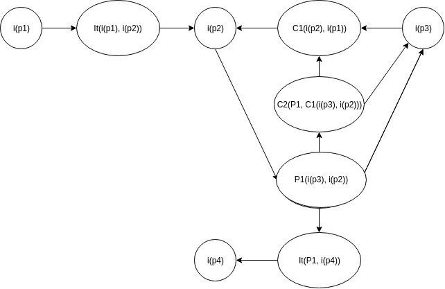
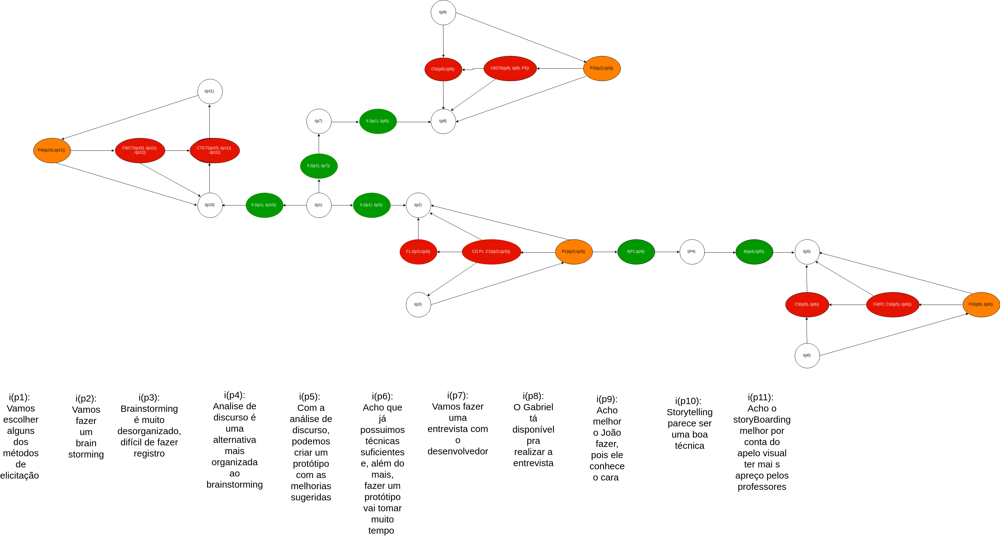

# Inspeção de Argumentação

## Introdução

Neste documento, iremos demonstrar a verificação para os os artefatos do modelo de argumentação. Através de alguns critérios para a avaliação do artefato, seguindo o framework Acceptability Evaluation (ACE), proposto por Jureta em 2009.

## Metodologia

Para executar a inspeção de cada artefato, foi desenvolvido uma tabela, contendo critérios e importância.  
Os critérios foram baseados no modelo ACE e em parâmetros definidos pela equipe. A importância de cada critério foi determinada levando em consideração pontos para que o artefato esteja em conformidade com o modelo proposto, sendo alto, as condições para que o artefato esteja correto, e baixo, que não necessáriamente a condição precise ser atendida mas que agregaria positivamente ao artefato. 
Além disso, tera alguns critérios para avaliação do documento como um todo.

## Critérios

Ao final do documento, foi disponibilizado um [material de apoio](#material-de-apoio-para-a-avaliacao) para os critérios a seguir.

|Nº|Critério|Material correspondente|Importância
|:--:|:--:|:--:|:--:|
||**Artefato**|||
|1|O diagrama foi representado na forma de um grafo?|[Exemplo](#4-exemplo)|Alto|
|2|As labels de cada vértice está correta?| [Labels](#1-labels)|Alto|
|3|Cada vértice foi formalmente e corretamente descrito?|[Descrição](#2-descricao-formal)|Baixo|
|4|A propagação (setas) dos vértices foram executadas de forma correta?|[Propagação](#3-propagacao)|Alto|
|5|Todos os conflitos, gerados na discussão, foram resolvidos?||Alto|
|6|Vértices de proposições, ligados somente por I, C, P?||Alto|
|7|Todas as inferências do diagrama foram descritas no artefato?|[Exemplo](#4-exemplo)|Médio|
|8|Os vértices foram destacados com cores, representando cada classificação, possibilitando uma melhor visualização?|[Exemplo](#4-exemplo)|Baixo|
|9|O artefato possui um nivel maturidade (pelo menos 2 conflitos e 6 proposições)?|[Exemplo](#4-exemplo)|Médio|
|10|As preferências foram descritas, mostrando como o conflito foi resolvido?|[Exemplo](#4-exemplo)|Médio|
||**Documento**|||
|11|O documento possui tabela de versionamento, registrando as modificações e seus respectivos autores?||Alto|
|12|Cada artefato possui versionamento individual?||Alto|

## Registro de inspeção

Para cada inspeção, será registrado o nome com o hiperlink para cada artefato, data e quem inspecionou o diagrama. É atribuido uma nota de 0 a 5 para cada critério, sendo 0, critério não foi satisfeito e 5, critério totalmente satisfeito. Além disso, são sugeridas melhorias para os critérios que tiverem falhado em ser atendidos. 
O artefato sera considerado válido, se atender o critério nº 5, os conflitos gerados na discussão forem resolvidos, houve uma preferência.

#### IARG-0X

|Diagrama de argumentação|Data da inspeção|Responsável pela inspeção|
|:--:|:--:|:--:|
|||||

|Nº|Critério|Importância|Material correspondente|Nota|Observação/Melhoria|
|:--:|:--:|:--:|:--:|:--:|:--:|
|1|O diagrama foi representado na forma de um grafo?|Alto|[Exemplo](#4-exemplo)|||
|2|As labels de cada vértice está correta?|Alto| [Labels](#1-labels)|||
|3|Cada vértice foi formalmente e corretamente descrito?|Baixo|[Descrição](#2-descricao-formal)|||
|4|A propagação (setas) dos vértices foram executadas de forma correta?|Alto|[Propagação](#3-propagacao)|||
|5|Todos os conflitos, gerados na discussão, foram resolvidos?|Alto||||
|6|Vértices de proposições, ligados somente por I, C, P?|Alto||||
|7|Todas as inferências do diagrama foram descritas no artefato?|Médio|[Exemplo](#4-exemplo)|||
|8|Os vértices foram destacados com cores, representando cada classificação, possibilitando uma melhor visualização?|Baixo|[Exemplo](#4-exemplo)|||
|9|O artefato possui um nivel maturidade (pelo menos 2 conflitos e 6 proposições)?|Médio|[Exemplo](#4-exemplo)|||
|10|As preferências foram descritas, mostrando como o conflito foi resolvido?|Médio|[Exemplo](#4-exemplo)|||

||**Resultados**||
|:--:|:--:|:--:|
|**Importância**|**Critérios atendidos**|**Pontuação total**|
|Alta|5|25|
|Médio|3|15|
|Baixo|2|10|
|**Total**|10|50|
||**Conclusão**||
||||

## Inspeção

#### IARG-01

|Diagrama de argumentação|Data da inspeção|Responsável pela inspeção|
|:--:|:--:|:--:|
|[AR1 - Escolha do app](../Pré-Rastreabilidade/Argumentacao.md/#ar1-escolha-do-app)|08/06/2019|Heron Rodrigues|

|Nº|Critério|Importância|Material correspondente|Nota|Observação/Melhoria|
|:--:|:--:|:--:|:--:|:--:|:--:|
|1|O diagrama foi representado na forma de um grafo?|Alto|[Exemplo](#4-exemplo)|5||
|2|As labels de cada vértice está correta?|Alto| [Labels](#1-labels)|5||
|3|Cada vértice foi formalmente e corretamente descrito?|Baixo|[Descrição](#2-descricao-formal)|5||
|4|A propagação (setas) dos vértices foram executadas de forma correta?|Alto|[Propagação](#3-propagacao)|5||
|5|Todos os conflitos, gerados na discussão, foram resolvidos?|Alto||5||
|6|Vértices de proposições, ligados somente por I, C, P?|Alto||5||
|7|Todas as inferências do diagrama foram descritas no artefato?|Médio|[Exemplo](#4-exemplo)|5||
|8|Os vértices foram destacados com cores, representando cada classificação, possibilitando uma melhor visualização?|Baixo|[Exemplo](#4-exemplo)|5||
|9|O artefato possui um nivel bom de discussão (no mínimo 2 conflitos e 6 proposições)?|Médio|[Exemplo](#4-exemplo)|5|Na segunda versão do artefato, já possui um nivel maior de maturidade do diagrama mas, ainda, só atende ao critério mínimo proposto|
|10|As preferências foram descritas, mostrando como o conflito foi resolvido?|Médio|[Exemplo](#4-exemplo)|5||

||**Resultados**||
|:--:|:--:|:--:|
|**Importância**|**Critérios atendidos**|**Pontuação total**|
|Alta|5|25|
|Médio|3|15|
|Baixo|2|10|
|**Total**|10|50|
||**Conclusão**||
||O artefato atende aos critérios mínimos propostos. Porém, ainda podem ser feitas algumas melhorias, principalmente em relação ao desenvolvimento da discussão||

#### IARG-02

|Diagrama de argumentação|Data da inspeção|Responsável pela inspeção|
|:--:|:--:|:--:|
|[AR5 - Diferencial do aplicativo](../Pré-Rastreabilidade/Argumentacao.md/#ar5-diferencial-do-aplicativo)|09/06/2019|Heron Rodrigues|

|Nº|Critério|Importância|Material correspondente|Nota|Observação/Melhoria|
|:--:|:--:|:--:|:--:|:--:|:--:|
|1|O diagrama foi representado na forma de um grafo?|Alto|[Exemplo](#4-exemplo)|5||
|2|As labels de cada vértice está correta?|Alto| [Labels](#1-labels)|5||
|3|Cada vértice foi formalmente e corretamente descrito?|Baixo|[Descrição](#2-descricao-formal)|2|Se guiando pela descrição das proposições, percebe-se que algumas inferências estão incorretas. Por exemplo, i(p4) não infere i(p3)|
|4|A propagação (setas) dos vértices foram executadas de forma correta?|Alto|[Propagação](#3-propagacao)|3|C2, gerado por P1, esta conflitando com i(p2), que foi a proposição preferida por P1 em relação à i(p1). Há também uma inferência, inferindo uma proposição|
|5|Todos os conflitos, gerados na discussão, foram resolvidos?|Alto||5||
|6|Vértices de proposições, ligados somente por I, C, P?|Alto||5||
|7|Todas as inferências do diagrama foram descritas no artefato?|Médio|[Exemplo](#4-exemplo)|5||
|8|Os vértices foram destacados com cores, representando cada classificação, possibilitando uma melhor visualização?|Baixo|[Exemplo](#4-exemplo)|5||
|9|O artefato possui um nivel maturidade (pelo menos 2 conflitos e 6 proposições)?|Médio|[Exemplo](#4-exemplo)|2|Poderia ter um maior desenvolvimento da discussão, possui apenas um conflito e cinco proposições|
|10|As preferências foram descritas, mostrando como o conflito foi resolvido?|Médio|[Exemplo](#4-exemplo)|0|Poderia ter sido descrito como o conflito gerado foi resolvido, por meio de votação, consenso..|

||**Resultados**||
|:--:|:--:|:--:|
|**Importância**|**Critérios atendidos**|**Pontuação total**|
|Alta|5|23|
|Médio|2|7|
|Baixo|2|7|
|**Total**|10|37|
||**Conclusão**||
||O artefato necessita ser revisado, principalmente por stá confuso as proposições com o que foi disposto no grafo e também poderia ter um maior desenvolvimento da discussão||

## Inspeção do documento

|Data da inspeção|Responsável pela inspeção|
|:--:|:--:|
|08/06/2019|Heron Rodrigues|

|Nº|Critério|Check|Observação/Melhoria|
|:--:|:--:|:--:|:--:|
|11|O documento possui tabela de versionamento, registrando as modificações e seus respectivos autores?| Sim ||
|12|Cada artefato possui versionamento individual?| Sim ||

## Material de apoio para a avaliação

### __1 - Labels:__
* __i__ - informações, proposições.
* __I__ - inferências.
* __C__ - conflito.
* __P__ - preferência.

### __2 - Descrição formal:__
* Ex. Conflito: C1(i(p2), i(p1))
* Ex. Inferência: It(i(p1), i(p2))
* Ex. Preferência:  P1(i(p1), i(p2))

### __3 - Propagação__

A partir da proposição de p1, podemos inferir a proposição de p2. A proposição de p3 gera conflito com a proposição de p2. Acaba gerando uma preferência por p2 em relação à p3 e essa preferência conflita com C1 e com p3. Pela preferência escolhida, podemos inferir p4.

### __4 - Exemplo__

## Referências

1 - JURETA, I.; MYLOPOULOS, J.; FAULKNER, S. Analysis of multi-party agreement in requirements validation. In: Proceedings of the 2009 17th IEEE International Requirements Engineering Conference, RE. Washington, DC, USA: IEEE Computer Society, 2009. (RE ’09), p. 57–66. ISBN 978-0-7695-3761-0.

2 - SERRANO, Maurício. Desenvolvimento Intencional de Software Transparente Baseado em Argumentação. 2011. Tese de Doutorado. PUC-Rio.

## Versionamento

| Data | Versão | Modificação | Autor |
|  --- | ------ | ----------- | ----- |
| 07/06/2019 | 1.0 | Abertura do documento | Heron Rodrigues |
| 08/06/2019 | 1.1 | Adição da inspeção do documento | Heron Rodrigues |
| 08/06/2019 | 1.2 | Adição da inspeção IARG-01 | Heron Rodrigues |
| 09/06/2019 | 1.3 | Adição da inspeção IARG-02 | Heron Rodrigues |
