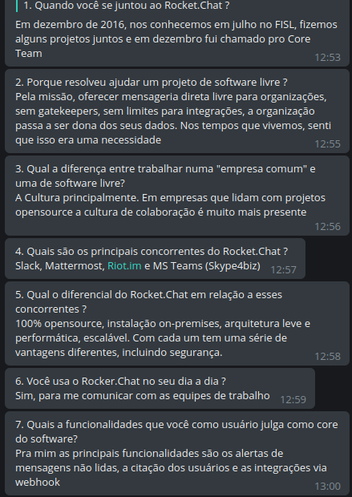
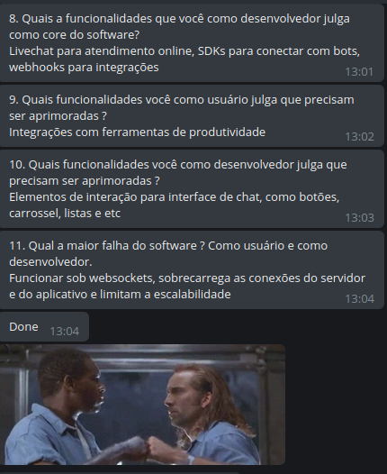

## 1. - O que é a entrevista ?

Técnica de elicitação de requisitos que se baseia em questionar os stakeholders sobre processos e sistemas atuais e sobre o que é desejado para o que vai ser desenvolvido. Entrevistas podem ser fechadas ou abertas, enquanto as fechadas são baseadas em um conjunto pré-existente de perguntas as abertas são sem script pré-definido, se adptando de acordo com o conhecimento do stakeholder.

O grupo utilizou a técnica com o Diego Dorgam, Bot Engineer na RocketChat. Para essa entrevista utilizamos a técnica de entrevista fechada já que só foi possível fazer a entrevista de forma não presencial através do Telegram. 

## Perguntas:

1. **Quando você se juntou ao Rocket.Chat?**

     "Em dezembro de 2016, nos conhecemos em julho no FISL, fizemos alguns projetos juntos e em dezembro fui chamado pro Core Team".

2. **Porque resolveu ajudar um projeto de software livre?**

     "Pela missão, oferecer mensageria direta livre para organizações, sem gatekeepers, sem limites para integrações, a organização passa a ser dona dos seus dados. Nos tempos que vivemos, senti que isso era uma necessidade".

3. **Qual a diferença entre trabalhar numa "empresa comum" e uma de software livre?**

     "A Cultura principalmente. Em empresas que lidam com projetos opensource a cultura de colaboração é muito mais presente."

4. **Quais são os principais concorrentes do Rocket.Chat?**

     "Slack, Mattermost, Riot.im e MS Teams (Skype4biz)."

5. **Qual o diferencial do Rocket.Chat em relação a esses concorrentes?**

     "100% opensource, instalação on-premises, arquitetura leve e performática, escalável. Com cada um tem uma série de vantagens diferentes, incluindo segurança."

6. **Você usa o Rocker.Chat no seu dia a dia?**

     "Sim, para me comunicar com as equipes de trabalho."

7. **Quais a funcionalidades que você como usuário julga como core do software?**

     "Pra mim as principais funcionalidades são os alertas de mensagens não lidas, a citação dos usuários e as integrações via webhook."

8. **Quais a funcionalidades que você como desenvolvedor julga como core do software?**

    "Livechat para atendimento online, SDKs para conectar com bots, webhooks para integrações."

9. **Quais funcionalidades você como usuário julga que precisam ser aprimoradas?** 

    "Integrações com ferramentas de produtividade."

10. **Quais funcionalidades você como desenvolvedor julga que precisam ser aprimoradas?** 

    "Elementos de interação para interface de chat, como botões, carrossel, listas e etc."

11. **Qual a maior falha do software ? Como usuário e como desenvolvedor.**

    "Funcionar sob websockets, sobrecarrega as conexões do servidor e do aplicativo e limitam a escalabilidade."

## Prints para rastreio:

## Versionamento

| Data | Versão | Modificação | Autor |
|  :------: | :------: | :------: | :------: |
| 09/04/2019 | 0.1 | Adição da entrevista | João Lucas |
| 09/04/2019 | 0.2 | Ajustando detalhes | Gabriel Davi |