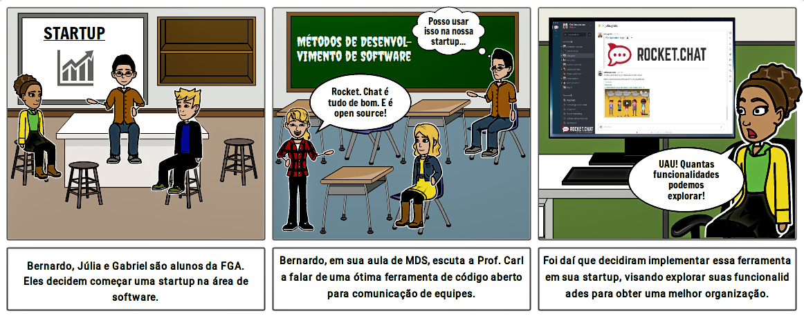
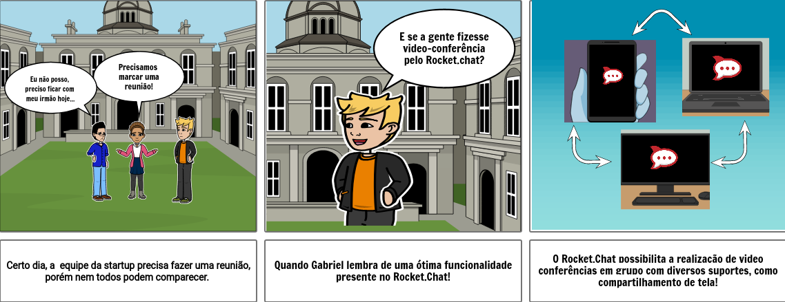
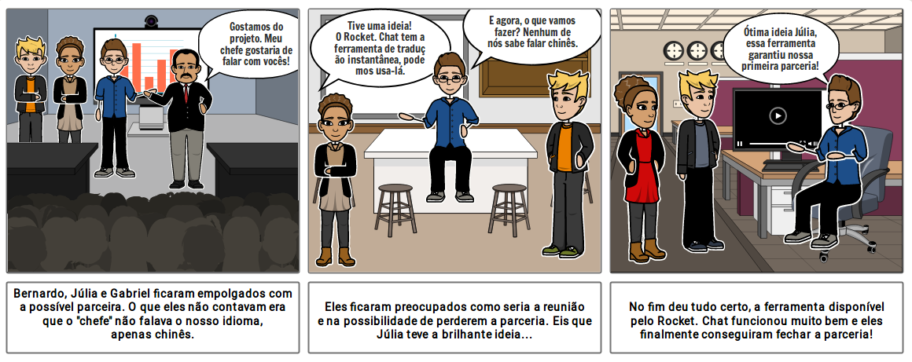
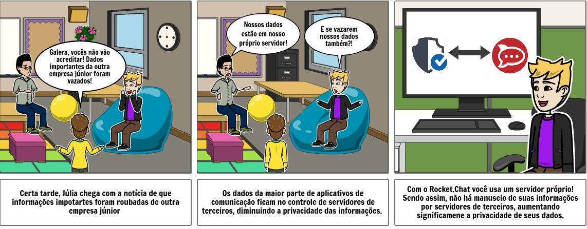
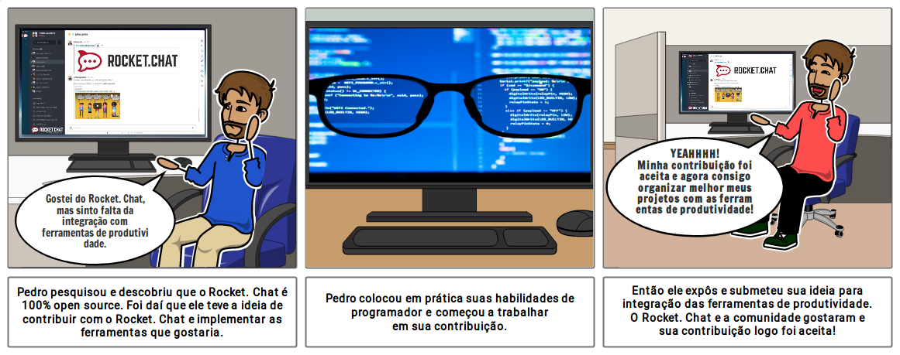

## Storyboard

## 1. O que é Storyboard?

O storyboard é uma sequência de desenhos quadro a quadro com o esboço das diversas cenas pensadas para um conteúdo. O visual desse esboço é semelhante ao de uma história em quadrinhos e o objetivo é elaborar e detalhar a sequência da narrativa.
Essa ferramenta é originalmente utilizada em animações, filmes e jogos, mas com o passar do tempo, tornou-se muito aplicada também em projetos para publicidade, marketing e software.
Ou seja, o objetivo é desenvolver uma sequência de ações da forma mais divertida, instigante e confortável visualmente possível, de forma a otimizar o engajamento do público.

## 2. Objetivo

O objetivo é de mostrar em quadrinhos como o <a href="https://marcosnbj.github.io/2019.1-RocketChat/">Rocket. Chat</a> e suas ferramentas vão elevar a experiência de um grupo de alunos a frente de uma startup de software.

Storyboard - Rocket.Chat v1.0

_____

Storyboard - Vídeo conferência v1.0

_____

Storyboard - Translate v1.0

_____

Storyboard - Segurança dos dados v1.0

_____

Storyboard - OpenSource v1.0

_____
## 3. Ferramenta utilizada

* [Storyboard That](https://www.storyboardthat.com/pt)

## 4. Requisitos obtidos

| Requisito | Storyboard | Prioridade |
|  :------: | :------: | :------: |
| O usuário deve ser capaz de realizar troca de mensagens | 1 | Must |
| A plataforma deve oferecer a divisão de conversas em channels | 1 | Must |
| A aplicação deve se manter OpenSource para receber contribuições de usuários | 1, 5 | Should |
| O usuário deve ser capaz de compartilhar a sua tela durante uma video conferência | 2, 3 | Should |
| A aplicação poderia oferecer uma tradução instantânea durante uma conversa| 3 | Would |
| A plataforma deve oferecer suporte pra mais idiomas | 3 | Should |
| A plataforma deve ter uma área para abranger o feedback de usuários | 5 | Could |
| Os usuários podem contribuir para o desenvolvimento da plataforma | 5 | Could |
| A plataforma deve permitir a integração com outras ferramentas | 5 | Should |
| As contribuições podem ser avaliadas pela comunidade| 5 | Could |
| O usuário deve ser capaz de realizar vídeo conferência | 2 | Should |
| A aplicação deve estar disponível em diferentes plataformas, como mobile e Desktop | 2 | Should |
| O app deve oferecer a possibilidade do usuário instalar seu próprio servidor privado | 4 | Must |

## 5. Fontes

* [Storyboard: por que ele é essencial?](https://rockcontent.com/blog/storyboard/)

## Versionamento

| Data | Versão | Modificação | Autor |
|  :------: | :------: | :------: | :------: |
| 07/04/2019 | 1.0 | Adição de storyboards | André Lucas |
| 09/04/2019 | 1.1 | Adição storyboard opensource | André Lucas |
| 09/04/2019 | 1.2 | Adição de requisitos e correções | André Lucas |
| 09/04/2019 | 1.3 | Adição dos storyBoard 2 e 4 | Gabriel Davi |
| 09/04/2019 | 1.4 | Adição de  Requisitos e priorizações | Gabriel Davi |
| 10/04/2019 | 1.5 | Ajustes | Gabriel Davi |
