#Questionário

Técnica de elicitação de requisitos na qual, focada em lídar com um grande número de pessoas, pelo qual seguimento diversas heurísticas recomendadas, elabora-se um grupo de perguntas que são respondidadas pelo público. Com as respostas, diversos insumos váliosos para a elicitação de requisitos podem ser levatandos, caso as perguntas tenham sido elaboradas corretamente.

## Metodologia

O questionário aqui utilizado procurou primeiro traçar o perfil de quem estava respondendo, e após isso separar o público em quem já usou e quem nunca usou o Rocket.chat. Para quem já haviam utilizado, foram feitas perguntas que procuravam análisar o nível de satisfação do usuário com ele, quais foram os principais diferenciais e pontos negativos, se o usuário ainda usa, em qual dispositivo e pra qual finalidade, e quais os principais concorrentes favorecidos. Já para quem nunca havia usado, as perguntas foram feitas de modo a concluír quais outros aplicativos de comunicação o usuário utiliza, tanto para fins pessoais quanto para fins acadêmicos, e quais são seus principais diferencias, pontos negativos, e funcionalidades que poderiam ter, bem como qual é o nível de satisfação no uso deles e em qual positivo é utilizado. No total, foram computadas 37 respostas.

## Resultados

#### 1. Perfil do público
Perguntas relacionadas a análisar o perfil das pessoas que responderam o questionário e dividi-las entre usuários e não-usuários do Rocket.chat

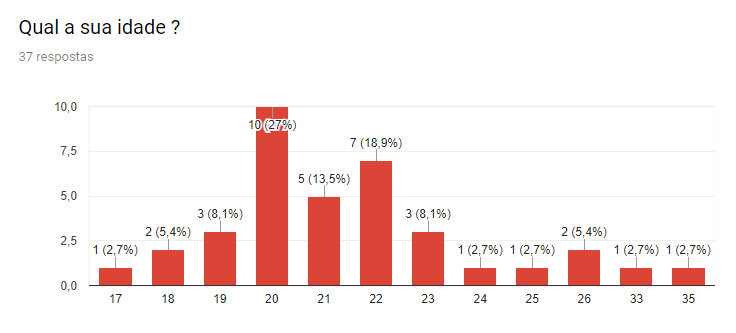
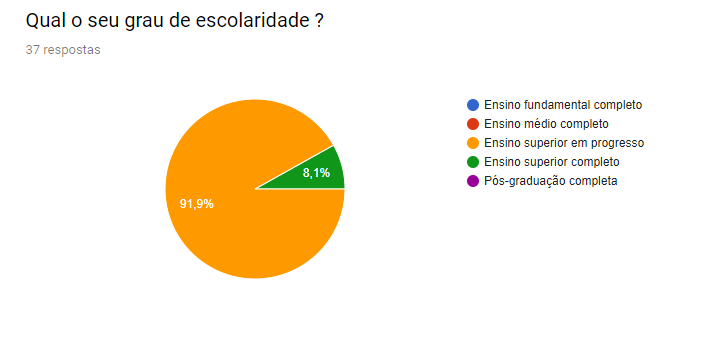
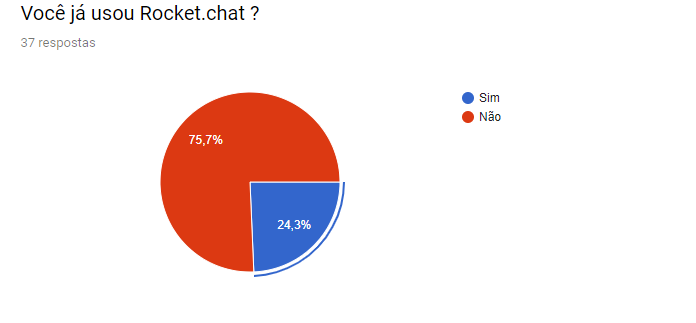

#### 2. Pessoas que nunca usaram a aplicação
Perguntas feitas ao público que nunca usou o Rocket.Chat

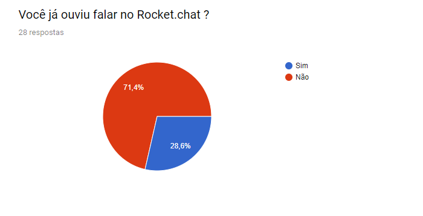
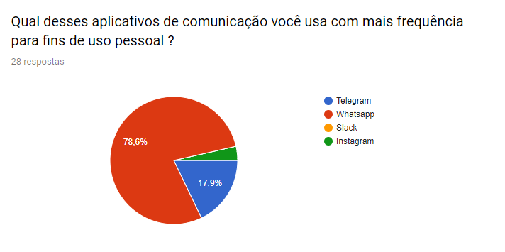
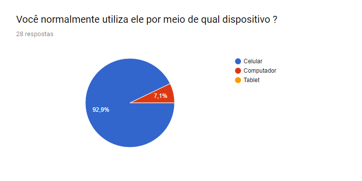
_Fomentando os requisitos: Q1_ 
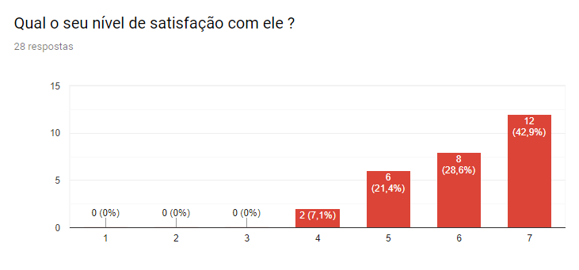

|Princpais pontos positivos levantados|Quantidade de usuários que apontaram|
|--|--|
|Popularidade|26|
|Os bots adicionam muitas outras possibilidades de funcionalidade|24|
|Possibilidade de enviar documentos, fotos, vídeos, aúdios|12|
|Possibilidade de apagar mensagens|6|
|Possibilidade de realizar backup de mensagens|2|
|Práticidade de uso da interface|20|
_Fomentando os requisitos: Q2 , Q5, Q6, Q7, Q8_ 

|Principais pontos negativos levantados|Quantidade de usuários que apontaram|
|--|--|
|Pouca customização visual|13|
|Chamada em grupo ruim|8|
|Chamada de voz ruim|12|
|Consome muito espaço|4|
|Versão Desktop ligada a versão mobile|18|
|Grupos pouco organizados|6|
_Fomentando os requisitos: Q3 , Q4, Q10, Q13, Q16, Q17_ 

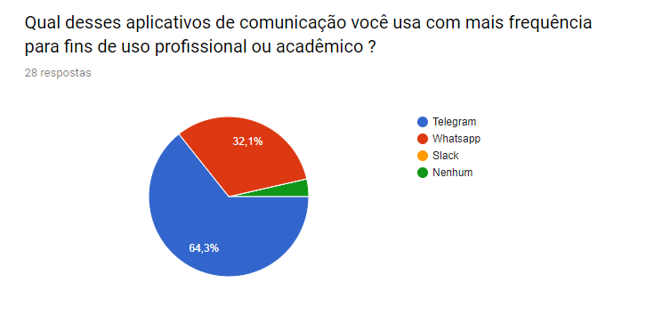
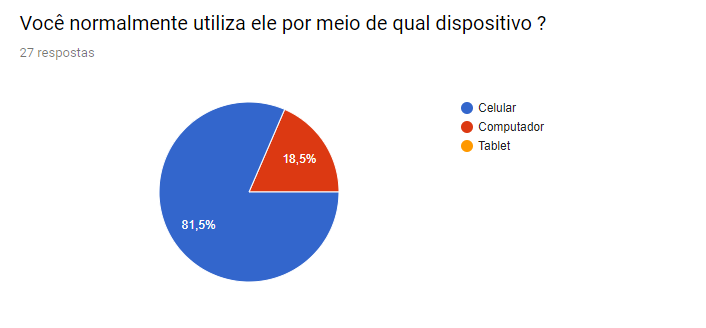
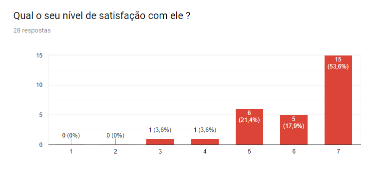

|Principais pontos positivos levantados|Quantidade de usuários que apontaram|
|--|--|
|Boas funcionalidades para conversas em grupo, como separação em channels|18|
|Muitas possibilidades de personalização|10|
|Não falha em notificar o usuário das mensagens que chegam|14|
|Integração com bots adiciona muitas funcionalidades|25|
_Fomentando os requisitos: Q16 , Q3, Q9, Q2_ 

|Principais pontos negativos levantados|Quantidade de usuários que apontaram|
|--|--|
|Falta de populariade entre usuários causais|14|
|Interface pouco intuitiva|17|
_Fomentando os requisitos: Q5_

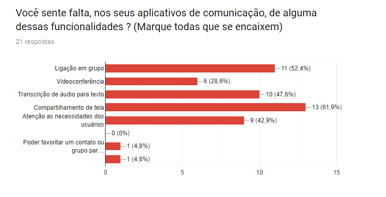
_Fomentando os requisitos: Q12, Q13, Q14, Q11, Q19_

#### 3. Pessoas que já utilizaram ou utilizam a aplicação
Perguntas feitas ao público que se classifica como usuário ou ex-usuário do Rocket.chat

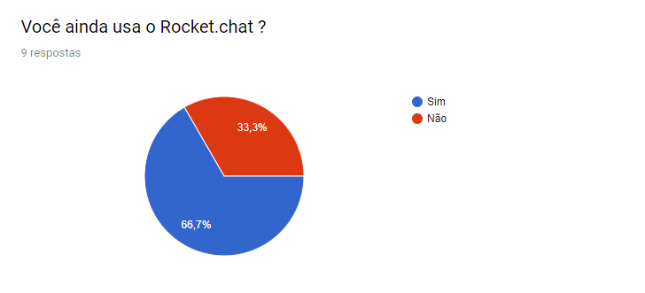
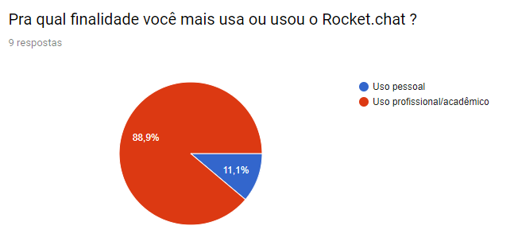
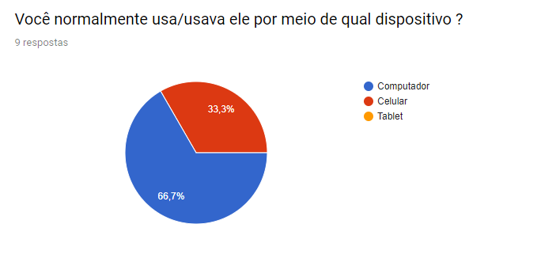
_Fomentando os requisitos: Q18_ 

|Principais diferenciais do Rocket.chat|Quantidade de usuários que apontaram|
|--|--|
|Software Livre|6|
|Poder subir sua própria instância|4|
|Open Source|6|
|Possibilidade de separar os grupos em channels|9|
|Funcionalidade de vídeoconferência|5|
|Compartilhamento de tela|7|
|Integração com bots|9|
_Fomentando os requisitos: Q19 , Q16, Q12, Q11, Q2, Q21_ 

|Principais pontos negativos do Rocket.chat|Quantidade de usuários que apontaram|
|--|--|
|Interface pouco intuitiva|8|
|Falta de notificações para quando o usuário não é mencionado|5|
|Muitas funcionalidades são pagas|4|
_Fomentando os requisitos: Q9 , Q3, Q20_ 

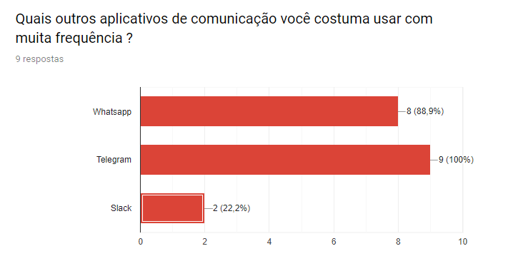
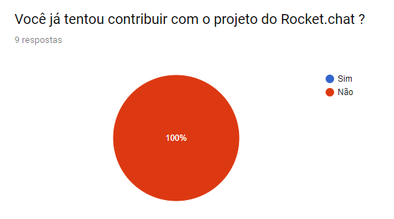

## Conclusão

É possível análisar pelo questionário que a maior parte das pessoas não é usuária do Rocket.chat, porém, embora parcialmente satisfeitas com os aplicativos que usam, gostariam de ter neles algumas funcionalidades que o Rocket.chat possuí. Já as pessoas que se classificam como usuários da aplicação, gostam muito de alguns diferenciais, mas sentem falta de algumas outras coisas. O questionário poderia ter cido ainda mais conclusivo se fosse respondido por um número maior de pessoas.

### Requisitos Elicitados 

Abaixo podem ser vistos de forma tabular os requisitos elicitados com base nos resultados das perguntas feitas e às estatísticas deles gerados . Foi utilizada a técnica MoSCoW de priorização, pela qual os requisitos recebem atribuições de prioridade que variam de Must, a mais alta, até Would, a mais baixa, passandor por Should e Could, que nessa ordem representam prioriádes intermediárias. Para estabelecer as prioridades, foi levado em consideração o número de pessoas que levantou cada ponto, e também dando pesos diferentes pra pontos que priorizam uso pessoal e uso profissional/acadêmico, já que o aplicativo é mais voltado para o segundo caso. 

| Código | Descrição | Prioridade |
 |--|--|--|
|Q1| Bom suporte para dispositivo mobile |  Must |
|Q2| Integração com Bots | Must |
|Q3| Customização visual | Could |
|Q4| Chamada de voz e vídeo | Must |
|Q5| Interface de fácil uso | Should |
|Q6|Possibilidade de enviar documentos, fotos, vídeos, aúdios| Should |
|Q7| Backup de mensagens| Would |
|Q8| Possibilidade de apagar as mensagens| Would |
|Q9| Notificações consistentes | Should |
|Q10| Não ocupar tanto espaço de armazenamento| Would |
|Q11| Compartilhamento de tela | Should |
|Q12| Vídeoconferência |Could|
|Q13| Chamada de voz em grupo| Should |
|Q14| Transcrição de áudio para texto | Could |
|Q15| Poder favoritar um contato ou grupo| Wold |
|Q16|Possibilidade de separar os grupos em channels| Must |
|Q17|Possibilitar acesso a versão desktop sem precisar do celular|Could|
|Q18| Bom suporte para dispositivo Desktop |  Must |
|Q19| Poder subir sua própria instância | Could |
|Q20| Maior quantidade de funcionalidades gratuítas | Would |
|Q21| Ser Open Source | Could |

Por fim, também de forma tabular, seguem os requisitos anteriormente listados, agora priorizados pelo método Fisrt Things First !

|                       |                     |                      |              |             |                |             |                |             |              | 
|-----------------------|---------------------|----------------------|--------------|-------------|----------------|-------------|----------------|-------------|--------------| 
| Funcionalidades (FTF) | Benefício  Relativo | Penalidade  Relativa | Valor  Total | Valor  %    | Custo Relativo | Custo %     | Risco Relativo | Risco %     | Prioridade   | 
|                       |                     |                      |              |             |                |             |                |             |              | 
| Q1                    | 8                   | 9                    | 25           | 6,702412869 | 6              | 6,382978723 | 6              | 6,896551724 | 0,6817454284 | 
| Q2                    | 8                   | 9                    | 25           | 6,702412869 | 6              | 6,382978723 | 6              | 6,896551724 | 0,6817454284 | 
| Q3                    | 6                   | 7                    | 19           | 5,09383378  | 4              | 4,255319149 | 3              | 3,448275862 | 0,8518890113 | 
| Q4                    | 6                   | 7                    | 19           | 5,09383378  | 5              | 5,319148936 | 5              | 5,747126437 | 0,6217518307 | 
| Q5                    | 7                   | 9                    | 23           | 6,166219839 | 4              | 4,255319149 | 4              | 4,597701149 | 0,9408086911 | 
| Q6                    | 8                   | 9                    | 25           | 6,702412869 | 5              | 5,319148936 | 4              | 4,597701149 | 0,8798127197 | 
| Q7                    | 4                   | 3                    | 11           | 2,949061662 | 3              | 3,191489362 | 3              | 3,448275862 | 0,599935977  | 
| Q8                    | 4                   | 3                    | 11           | 2,949061662 | 2              | 2,127659574 | 2              | 2,298850575 | 0,8999039654 | 
| Q9                    | 5                   | 5                    | 15           | 4,021447721 | 5              | 5,319148936 | 2              | 2,298850575 | 0,621689971  | 
| Q10                   | 4                   | 6                    | 14           | 3,753351206 | 5              | 5,319148936 | 4              | 4,597701149 | 0,4926951231 | 
| Q11                   | 6                   | 7                    | 19           | 5,09383378  | 4              | 4,255319149 | 5              | 5,747126437 | 0,7145346939 | 
| Q12                   | 7                   | 8                    | 22           | 5,898123324 | 5              | 5,319148936 | 5              | 5,747126437 | 0,7199231723 | 
| Q13                   | 7                   | 8                    | 22           | 5,898123324 | 5              | 5,319148936 | 6              | 6,896551724 | 0,6727315557 | 
| Q14                   | 5                   | 4                    | 14           | 3,753351206 | 4              | 4,255319149 | 8              | 9,195402299 | 0,4239627924 | 
| Q15                   | 4                   | 3                    | 11           | 2,949061662 | 2              | 2,127659574 | 4              | 4,597701149 | 0,6662272451 | 
| Q16                   | 7                   | 9                    | 23           | 6,166219839 | 4              | 4,255319149 | 4              | 4,597701149 | 0,9408086911 | 
| Q17                   | 5                   | 5                    | 15           | 4,021447721 | 5              | 5,319148936 | 3              | 3,448275862 | 0,5709617962 | 
| Q18                   | 6                   | 7                    | 19           | 5,09383378  | 5              | 5,319148936 | 4              | 4,597701149 | 0,668657667  | 
| Q19                   | 5                   | 6                    | 16           | 4,289544236 | 6              | 6,382978723 | 5              | 5,747126437 | 0,4634067736 | 
| Q20                   | 4                   | 3                    | 11           | 2,949061662 | 6              | 6,382978723 | 2              | 2,298850575 | 0,3915166603 | 
| Q21                   | 6                   | 2                    | 14           | 3,753351206 | 3              | 3,191489362 | 2              | 2,298850575 | 0,8646452441 | 
| TOTAL                 | 122                 | 129                  | 373          | 100         | 94             | 100         | 87             | 100         |              | 
