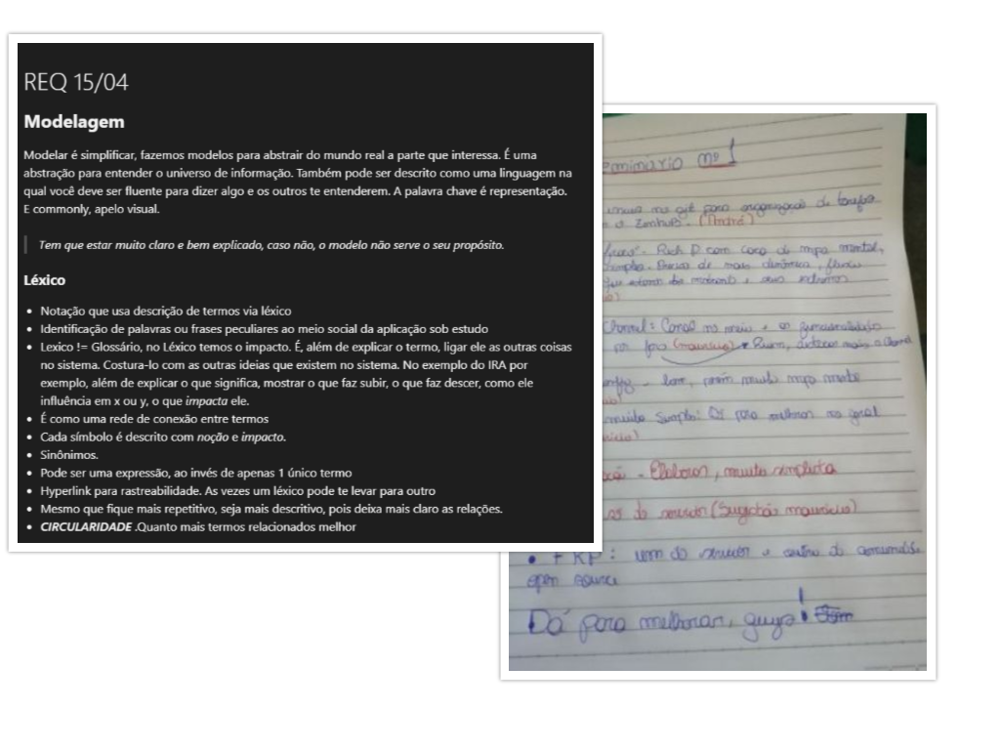
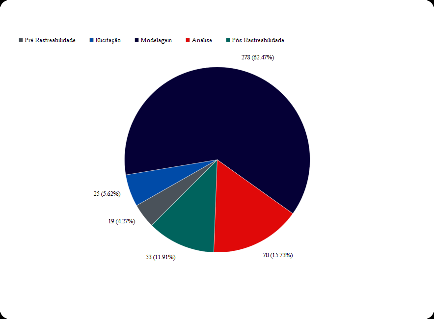
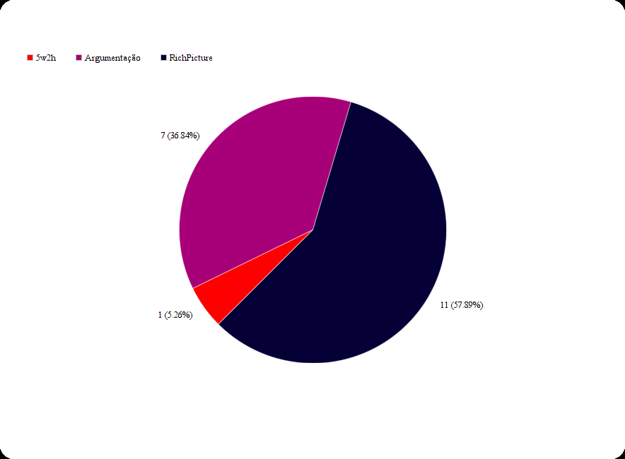
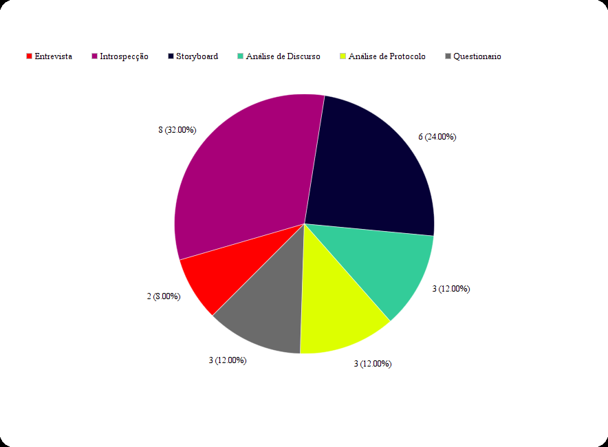
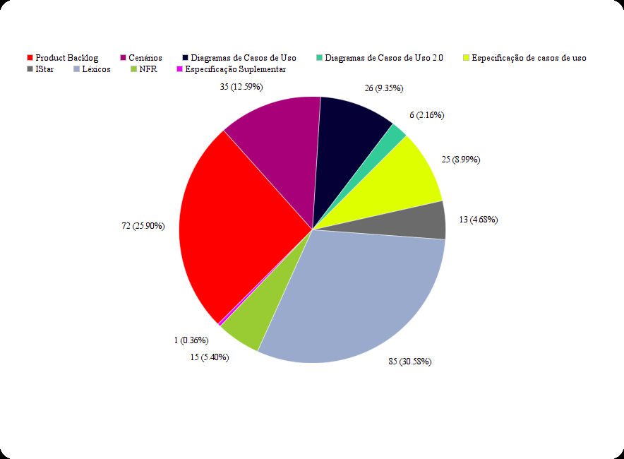
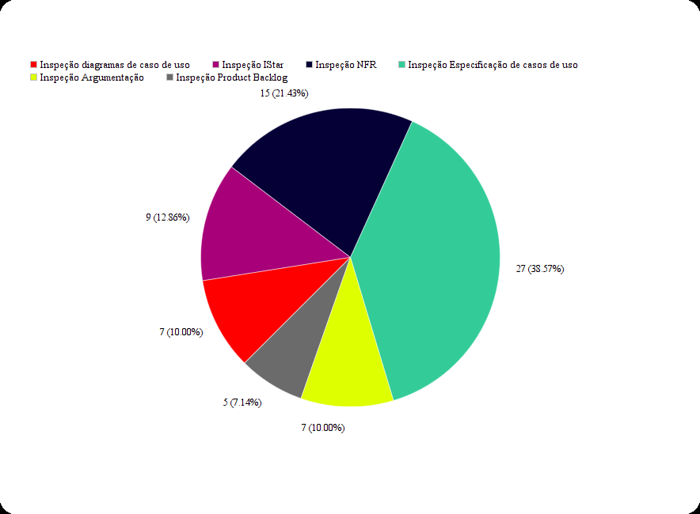
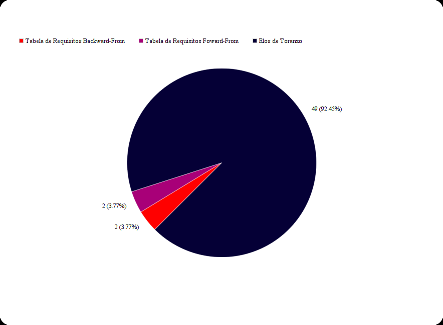
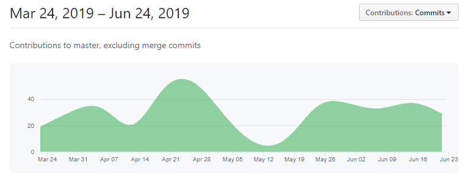

# Metricas finais da Wiki

Neste documento são listadas algumas métricas resultantes de uma análise final da wiki do repositório.

## Metodologia Geral

### Resumo geral do padrão de metogologia ao longo do semestre

Para estabelecer como seriam feitas as entregas para cada módulo, o grupo considerou os membros que estariam com mais disponibilidade e a dificuldade para a produção de cada artefato dejesado, além do conhecimento adquirido nas aulas e a experiência adquirida através dos trabalhos de grupos em semestres anteriores. Dessa forma, em cada módulo o grupo se subdividiu em pequenos grupos ou duplas, em alguns poucos casos individualmente, e então produziu aquilo que era suposto na dada entrega. Por fim, eram feitas anotações acerca dos defeitos que os professores apontavam na entrega, que eram posteriormente utilizadas para atualizar os documentos dessa entrega.  

## Gráficos

Aqui estão disponíveis alguns gráficos que demonstram numericamente os artefos produzidos neste repositório. Embora os números não sirvam para fazer avaliações qualitativas, por meio dos gráficos pode ser observada a quantidade de artefatos de requisitos de software produzidos em cada módulo. É também importante ressaltar que alguns artefatos são mais simples de serem feitos que outros, essa diferença também não é bem reprezentada pelos números. Dessa forma, os números apenas servem para ajudar a demonstrar o esforço do grupo na busca pela obtenção dos resultados.

### G1-Total de Artefatos

Foram produzidos um total de 445 artefatos, incluindo versões diferentes de um dado artefato.

### G2-Pré Rastreabilidade

### G3-Elicitação

### G4-Modelagem

### G5-Análise

### G6-Pós Rastreabilidade

## Commits

Uma falha do grupo que pode ser observada pelo gráfico dos commits no repositório ao longo do semestre é que em alguns pontos específicos o trabalho não foi contínuo e o grupo falhou em ter recursos humanos suficientes para completar a tarefa proposta, no entanto, de forma geral é possível ver que na maioria dos períodos fora os citados o trabalho foi homogêneo.

## Versionamento

| Data | Versão | Modificação | Autor |
|------|--------|-------------|-------|
| 23/06/2019 | 1.0 | Abertura do documento | Marcos Nery |
| 24/06/2019 | 1.1 | Inclusão dos gráficos | Marcos Nery |
| 24/06/2019 | 1.2 | Inclusão do gráfico dos commits | Marcos Nery |
| 24/06/2019 | 1.3 | Inclusão das metodologias | Marcos Nery |

