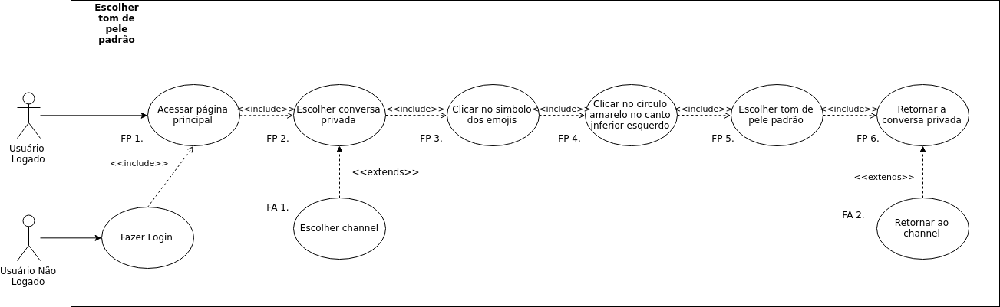

# Diagramas de Caso de Uso

## Introdução
Os diagramas de caso de uso são representações esquematizadas possíveis ações que podem ser realizadas pelo usuário dentro da plataforma. Os seguintes casos de uso tiveram como base os [cenários](cenarios.md) levantados pelo grupo. Vale ressaltar que, para fins de melhor descrição de cada caso modelado, os diagramas levantados pela equipe possuem uma [especificação de caso de uso]().

## DCU1 - V1
### **Realização de Video chat**
Diagrama inspirado pelo cenário **[Video Chat](cenarios.md#c2)**

Especificação de casos de uso: [ECU-20](especificacao.md#ec20)

## DCU1 - V2
### **Realização de Video chat**
Diagrama inspirado pelo cenário **[Video Chat](cenarios.md#c2)**

Especificação de casos de uso: [ECU-20](especificacao.md#ec20)

## DCU2 - V1
### **Enviar mensagem**
Diagrama inspirado pelo cenário **[Enviar mensagem](cenarios.md#c12)**

Especificação de casos de uso: [ECU](especificacao.md#ec15)

## DCU2 - V2
### **Enviar mensagem**
Diagrama inspirado pelo cenário **[Enviar mensagem](cenarios.md#c12)**

Especificação de casos de uso: [ECU-15](especificacao.md#ec15)

## DCU2 - V3
### **Enviar mensagem**
Diagrama inspirado pelo cenário **[Enviar mensagem](cenarios.md#c12)**

Especificação de casos de uso: [ECU-15](especificacao.md#ec15)

## DCU3
### **Fixar Mensagem**
Diagrama inspirado pelos cenários **[Fixar Mensagem](cenarios.md#c11)** e **[Visualizar Mensagens Fixadas](cenarios.md#c25)**

[Especificação de casos de uso: ECU - 1](especificacao.md#ec1) e  [Especificação de casos de uso: ECU - 12](especificacao.md#ec12)

- **V1**

- **V2**

## DCU4 - V1
### **Alterar status**
Diagrama inspirado pelo cenário **[Alterar Status](cenarios.md#c10)**

[Especificação de casos de uso: ECU - 4](especificacao.md#ec4)

## DCU5 - V1
### **Deletar Conta**
Diagrama inspirado pelo cenário **[Deletar Conta](cenarios.md#c6)**

[Especificação de casos de uso: ECU - 5](especificacao.md#ec5)

## DCU6 - V1
### **Mensagens Favoritadas**
Diagrama inspirado pelo cenário **[Favoritar mensagem](cenarios.md#c13)**

[Especificação de casos de uso: ECU - 6](especificacao.md#ec6)

## DCU7 - V1
### **Visualizar Membros de Chat em Grupo**
Diagrama inspirado pelo cenário **[Visualizar Membros de Chat em Grupo](cenarios.md#c14)**

[Especificação de casos de uso: ECU - 7](especificacao.md#ec7)

## DCU8 - V1
### **Privacidade do Channel**
Diagrama inspirado pelo cenário **[Mudar privacidade do Channel](cenarios.md#c26)**

[Especificação de casos de uso: EC - 2](especificacao.md#ec2)

## DCU9 - V1
### **Only-read Channel**
Diagrama inspirado pelo cenário **[Criar only-read Channel](cenarios.md#c22)**

[Especificação de casos de uso: EC - 3](especificacao.md#ec3)

## DCU10 - V1
### **Channel owner**
Diagrama inspirado pelo cenário **[Definir membro de channel como proprietário](cenarios.md#23)**

[Especificação de casos de uso: EC - 8](especificacao.md#ec8)

## DCU11 - V1
### **Escolher tom de pele padrão**
Diagrama inspirado pelo cenário **[Escolher tom de pele padrão](cenarios.md#21)**

[Especificação de casos de uso: EC - 9](especificacao.md#ec9)

## DCU12 - V1
### **Pesquisa de mensagem**
Diagrama inspirado pelo cenário **[Pesquisar mensagem](cenarios.md#c17)**

Especificação de casos de uso: [EC - 13](especificacao.md#ec13)

## DCU13 - V1
### **Realização de login**
Diagrama inspirado pelo cenário **[Fazer login](cenarios.md#18)**

Especificação de casos de uso: [EC - 14](especificacao.md#ec14)

## DCU14 - V1
### **Recebendo notificações**
Diagrama inspirado pelo cenário **[Receber notificações](cenarios.md#c19)**

Especificação de casos de uso: [Especificação de casos de uso: EC24](especificacao.md#ec24)

## DCU15 - V1
### **Sair do aplicativo**
Diagrama inspirado pelo cenário **[Sair do Rocket.chat](cenarios.md#c20)**

Especificação de casos de uso: [Especificação de casos de uso: EC5](especificacao.md#ec5)

## DCU16 - V1
### **Criar chat**
Diagrama inspirado pelo cenário **[Criar chat](cenarios.md#c3-v2)**

Especificação de casos de uso: [ECU10](especificacao.md#ec10)

## DCU17 - V1
### **Conectar com um servidor**
Diagrama inspirado pelo cenário **[Conectar com um servidor](cenarios.md#c4-v2)**

Especificação de casos de uso: [ECU11](especificacao.md#ec11)

## DCU18 - V1
### **Anexar um Arquivo a mensagem**
Diagrama inspirado pelos cenários  **[Anexar um arquivo](cenarios.md#c9)** e **[Anexar um desenho](cenarios.md#c8)**

Especificações de casos de uso: [ECU16](especificacao.md#ec16) e [ECU17](especificacao.md#ec17)

## DCU19 - V1
### **Editar uma mensagem**
Diagrama inspirado pelo cenário **[Editar uma Mensagem](cenarios.md#c5)**

Especificação de casos de uso: [ECU19](especificacao.md#ec19)

## DCU20 - V1
### **Responder uma mensagem**
Diagrama inspirado pelo cenário **[Responder uma mensagem](cenarios.md#c7)**

Especificação de casos de uso: [ECU18](especificacao.md#ec18)

## DCU21 - V1
### **Cadastrar novo usuário**
Diagrama inspirado pelo cenário **[Cadastrar novo usuário](cenarios.md#c1-v1)**

Especificação de casos de uso: [ECU21](especificacao.md#ec21)

## DCU22 - V1
### **Sair de um channel**
Diagrama inspirado pelo cenário **[Sair de um channel](cenarios.md#c15-v1)**

Especificação de casos de uso: [EC22](especificacao.md#ec22)

## DCU23 - V1
### **Esconder um channel**
Diagrama inspirado pelo cenário **[Esconder um channel](cenarios.md#c16-v1)**

Especificação de casos de uso: [ECU23](especificacao.md#ec23)

## Versionamento

| Data | Versão | Modificação | Autor |
|  :------: | :------: | :------: | :------: |
| 25/04/2019 | 1.0 | Abertura do documento | Gabriel Davi|
| 28/04/2019 | 1.1 | Adição dos diagramas DCU1 - V1, DCU1 - V2, DCU2 - V1, DCU2 - V2 | Gabriel Davi|
| 28/04/2019 | 1.2 | Adição dos diagramas DCU4 - V1, DCU5 - V1, DCU6 - V1 e DCU7 - V1 | WeillerFernandes |
| 28/04/2019 | 1.3 | Adição dos diagramas DCU8 - V1, DCU9 - V1, DCU10 - V1 e DCU11 - V1 | João Lucas |
| 28/04/2019 | 1.4 | Adição dos diagramas DCU12 - DCU15 | André Lucas |
| 28/04/2019 | 1.5 | Adição dos diagramas DCU16 e DCU17 | Heron Rodrigues |
| 28/04/2019 | 1.6 | Adição do diagrama DCU3 - V1 | Lucas Maciel |
| 28/04/2019 | 1.7 | Adição dos diagramas DCU18, DCU19, DCU20 e DCU2 - V3 | Marcos Nery |
| 29/04/2019 | 1.8 | Adição dos diagramas DCU21 a DCU22 -V1| Gabriel Davi |
