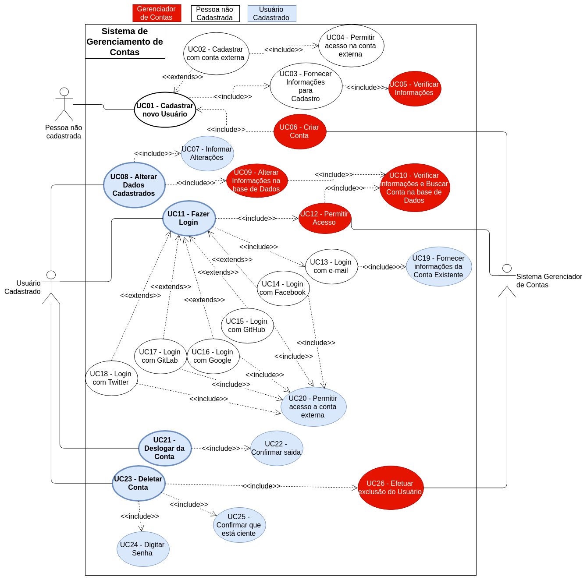

# Diagramas de Caso de Uso 2.0

## Introdução

Os diagramas de caso de uso são representações esquematizadas possíveis ações que podem ser realizadas pelo usuário dentro da plataforma. Os seguintes casos de uso tiveram como base os [cenários](cenarios.md) levantados pelo grupo. Vale ressaltar que, para fins de melhor descrição de cada caso modelado, os diagramas levantados pela equipe possuem uma [especificação de caso de uso](especificacao.md).
**Esse documento é uma evolução do documento [Diagrama de casos de Uso](diagramas.md)**.
Diferentemente do documento anterior, foi decidido entre os integrantes do grupo que fosse agrupado os casos de uso anteriores por temas, ou ambientes em que o usuário interage dentro do aplicativo Rocket.Chat.
Neste documento os "temas" escolhidos para os diagramas são: Gerenciamento de Contas, Mensagens, VideoChat, Configurações gerais, Controle dos Channels/Rooms(Nome a qual são chamados os grupos dentro do aplicativo) e Servidores.

## DCU01

### __Gerenciamento de Contas__

* __Id dos casos de Uso gerados:__ UC01 - UC26

* __Diagrama baseado nos diagramas anterirores:__

    * [DCU5-V1](diagramas.md#dcu5-v1):
        * Diagrama inspirado pelo cenário **[Deletar Conta](cenarios.md#c6)**
        * [Especificação de casos de uso: EC5](especificacao.md#ec5)
    * [DCU13-V1](diagramas.md#dcu13-v1):
        * Diagrama inspirado pelo cenário **[Fazer login](cenarios.md#18)**
        * [Especificação de casos de uso: EC14](especificacao.md#ec14)
    * [DCU15-V1](diagramas.md#dcu15-v1):
        * Diagrama inspirado pelo cenário **[Sair do Rocket.chat](cenarios.md#c20)**
        * [Especificação de casos de uso: EC25](especificacao.md#ec25)
    * [DCU21-V1](diagramas.md#dcu21-v1):
        * Diagrama inspirado pelo cenário **[Cadastrar novo usuário](cenarios.md#c1-v1)**
        * [Especificação de casos de uso: EC21](especificacao.md#ec21)

## DCU02

### __Controle dos Channels__

* __Id dos casos de Uso gerados:__ UC27 - UC43

* __Diagrama baseado nos diagramas anterirores:__

    * [DCU7-V1](diagramas.md#dcu7-v1):
        * Diagrama inspirado pelo cenário **[Visualizar Membros de Chat em Grupo](cenarios.md#c14)**
        * [Especificação de casos de uso: EC7](especificacao.md#ec7)
    * [DCU8-V1](diagramas.md#dcu8-v1):
        * Diagrama inspirado pelo cenário **[Mudar privacidade do Channel](cenarios.md#c26)**
        * [Especificação de casos de uso: EC2](especificacao.md#ec2)
    * [DCU9-V1](diagramas.md#dcu9-v1):
        * Diagrama inspirado pelo cenário **[Criar only-read Channel](cenarios.md#c22)**
        * [Especificação de casos de uso: EC3](especificacao.md#ec3)
    * [DCU10](diagramas.md#dcu10-v1):
        * Diagrama inspirado pelo cenário **[Definir membro de channel como proprietário](cenarios.md#23)**
        * [Especificação de casos de uso: EC8](especificacao.md#ec8)
    * [DCU16-V1](diagramas.md#dcu16-v1):
        * Diagrama inspirado pelo cenário **[Criar chat](cenarios.md#c3-v2)**
        * Especificação de casos de uso: [EC10](especificacao.md#ec10)
    * [DCU22-V1](diagramas.md#dcu22-v1):
        * Diagrama inspirado pelo cenário **[Sair de um channel](cenarios.md#c15-v1)**
        * Especificação de casos de uso: [EC22](especificacao.md#ec22)
    * [DCU23-V1](diagramas.md#dcu23-v1):
        * Diagrama inspirado pelo cenário **[Esconder um channel](cenarios.md#c16-v1)**
        * Especificação de casos de uso: [EC23](especificacao.md#ec23)

## DCU03

### __Mensagens__

* __Id dos casos de Uso gerados:__ UC44 - UC71

* __Diagrama baseado nos diagramas anterirores:__

    * [DCU2-V3](diagramas.md#dcu2-v3):
        * Diagrama inspirado pelo cenário **[Enviar mensagem](cenarios.md#c12)**
        * Especificação de casos de uso: [EC15](especificacao.md#ec15)
    * [DCU3](diagramas.md#dcu3):
        * Diagrama inspirado pelos cenários **[Fixar Mensagem](cenarios.md#c11)** e **[Visualizar Mensagens     Fixadas](cenarios.md#c25)**
        * [Especificação de casos de uso: EC1](especificacao.md#ec1) e  [Especificação de casos de uso: EC12](especificacao.md#ec12)
    * [DCU6-V1](diagramas.md#dcu6-v1):
        * Diagrama inspirado pelo cenário **[Favoritar mensagem](cenarios.md#c13)**
        * [Especificação de casos de uso: EC6](especificacao.md#ec6)
    * [DCU11-V1](diagramas.md#dcu11-v1):
        * Diagrama inspirado pelo cenário **[Escolher tom de pele padrão](cenarios.md#21)**
        * [Especificação de casos de uso: EC9](especificacao.md#ec9)
    * [DCU12-V1](diagramas.md#dcu12-v1):
        * Diagrama inspirado pelo cenário **[Pesquisar mensagem](cenarios.md#c17)**
        * Especificação de casos de uso: [EC13](especificacao.md#ec13)
    * [DCU18-V1](diagramas.md#dcu18-v1):
        * Diagrama inspirado pelos cenários  **[Anexar um arquivo](cenarios.md#c9)** e **[Anexar um desenho](cenarios.md#c8)**
        * Especificações de casos de uso: [EC16](especificacao.md#ec16) e [EC17](especificacao.md#ec17)
    * [DCU19-V1](diagramas.md#dcu19-v1):
        * Diagrama inspirado pelo cenário **[Editar uma Mensagem](cenarios.md#c5)**
        * Especificação de casos de uso: [EC19](especificacao.md#ec19)
    * [DCU20-V1](diagramas.md#dcu20-v1):
        * Diagrama inspirado pelo cenário **[Responder uma mensagem](cenarios.md#c7)**
        * Especificação de casos de uso: [EC18](especificacao.md#ec18)

## DCU04

### __VideoChat__

* __Id dos casos de Uso gerados:__ UC73 - UC82

* __Diagrama baseado nos diagramas anterirores:__

    * [DCU1-V2](diagramas.md#dcu1-v2):
        * Diagrama inspirado pelo cenário **[Video Chat](cenarios.md#c2)**
        * Especificação de casos de uso: [EC20](especificacao.md#ec20)
    * [DCU14-V1](diagramas.md#dcu14-v1):
        * Diagrama inspirado pelo cenário **[Receber notificações](cenarios.md#c19)**

## DCU05

### __Configurações Gerais__

* __Diagrama baseado nos diagramas anterirores:__

    * [DCU4-V1](diagramas.md#dcu4-v1):
        * Diagrama inspirado pelo cenário **[Alterar Status](cenarios.md#c10)**
        * [Especificação de casos de uso: EC4](especificacao.md#ec4)

## DCU06

### __Servidores__

* __Diagrama baseado nos diagramas anterirores:__

    * [DCU17-V1](diagramas.md#dcu17-v1):
        * Diagrama inspirado pelo cenário **[Conectar com um servidor](cenarios.md#c4-v2)**
        * Especificação de casos de uso: [EC11](especificacao.md#ec11)

## Versionamento

| Data       | Versão | Modificação           | Autor        |
|------------|--------|-----------------------|--------------|
| 21/06/2019 | 1.0    | Abertura do documento | Lucas Maciel |
| 21/06/2019 | 1.1    | Padronização da rastreabilidade dos diagramas | Lucas Maciel |
| 21/06/2019 | 1.2    | Adição do Diagrama DCU01 - DCU3 | Lucas Maciel |
| 21/06/2019 | 1.3    | Adição do Diagrama DCU04 | Gabriel Davi |
| 22/06/2019 | 1.4 | Adição do Diagrama DCU05 | André Lucas |
