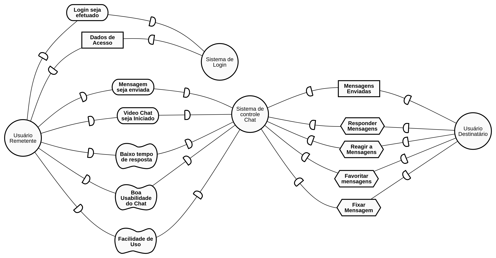

# IStar

## Strategic Dependency Models

### IS01 - Chat

#### Versão 01

### IS02 - Geral

#### Versão 01

## Strategic Rationale Models

### SR01 - Criar channel

#### Versão 01

### SR02 - Realizar cadastro

#### Versão 01

## Versionamento

| Data | Versão | Modificação | Autor |
|  --- | ------ | ----------- | ----- |
| 26/05/2019 | 1.0 | Abertura do documento | Lucas Maciel |
| 26/05/2019 | 1.1 | Adição do IS01 - V1 | Lucas Maciel |
| 26/05/2019 | 1.2 | Adição dos IS02 - V1, SR01 - V1, SR02 - V1 | Heron Rodrigues |
