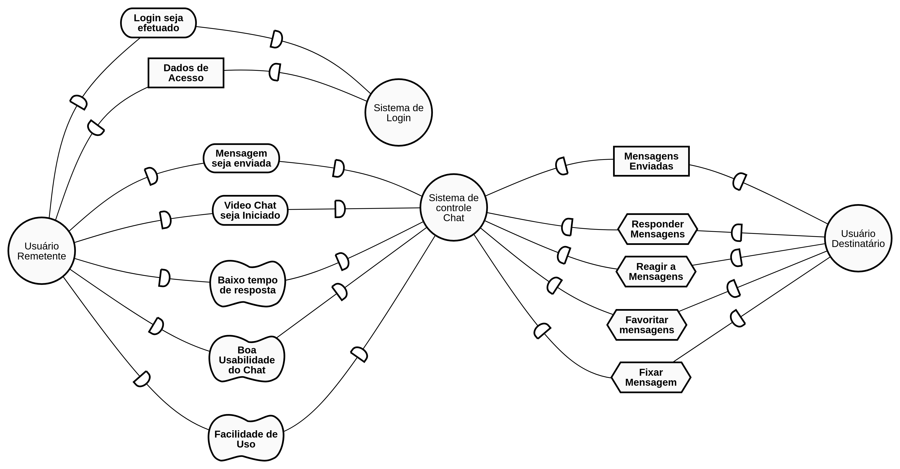
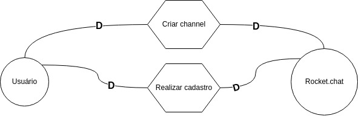
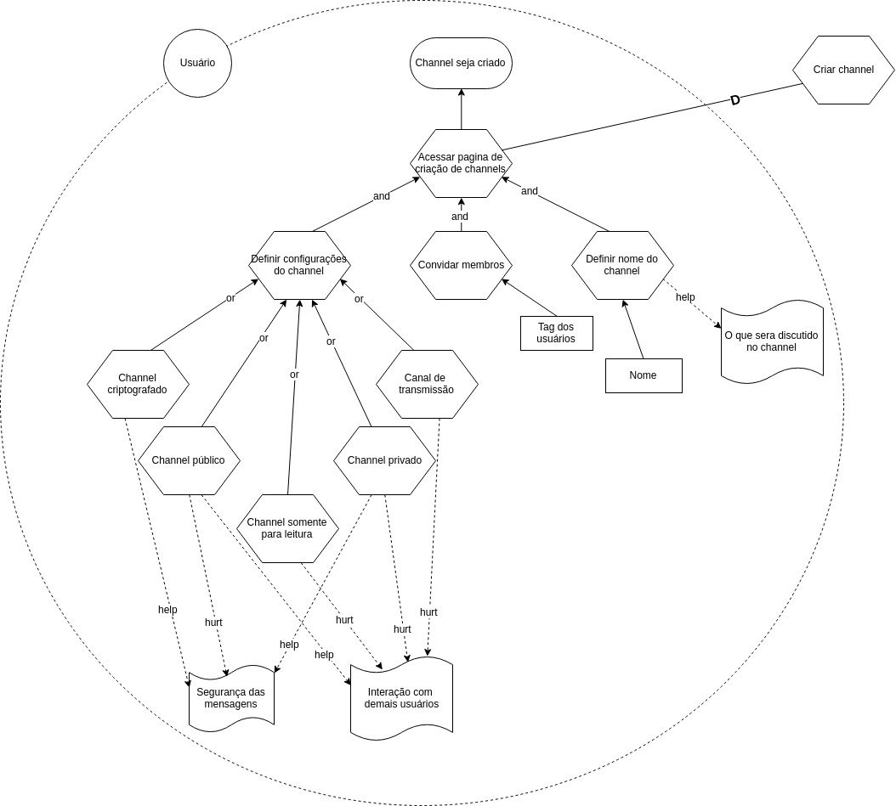
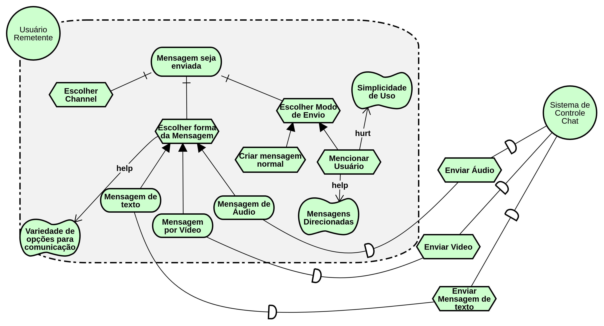

# IStar

## Strategic Dependency Models

### ISD01 - Chat

#### Versão 01

### ISD02 - Geral

#### Versão 01

## Strategic Rationale Models

### ISR01 - Criar channel

#### Versão 01

### ISR02 - Realizar cadastro

#### Versão 01

### ISR03 - Envio de Mensagens

## Versionamento

| Data | Versão | Modificação | Autor |
|  --- | ------ | ----------- | ----- |
| 26/05/2019 | 1.0 | Abertura do documento | Lucas Maciel |
| 26/05/2019 | 1.1 | Adição do ISD01 - V1 | Lucas Maciel |
| 26/05/2019 | 1.2 | Adição dos ISD02 - V1, ISR01 - V1, ISR02 - V1 | Heron Rodrigues |
| 27/05/2019 | 1.3 | Adição do ISR03 - V1 | Lucas Maciel |
