# IStar

## Strategic Dependency Models

#### ISD01 - Chat

#### Versão 01

#### Versão 02
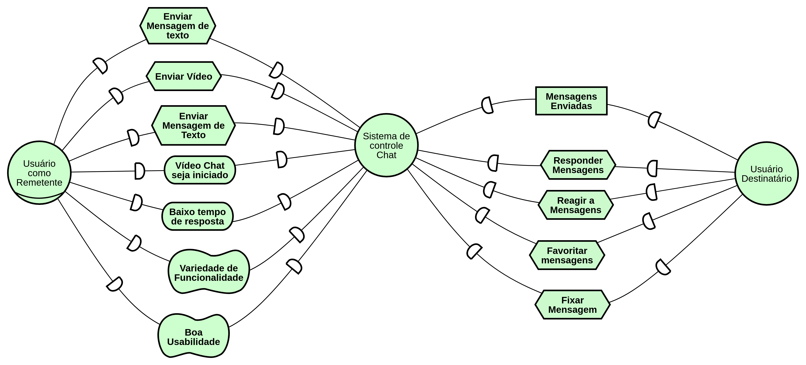

#### ISD02 - Geral

#### Versão 01

#### Versão 02
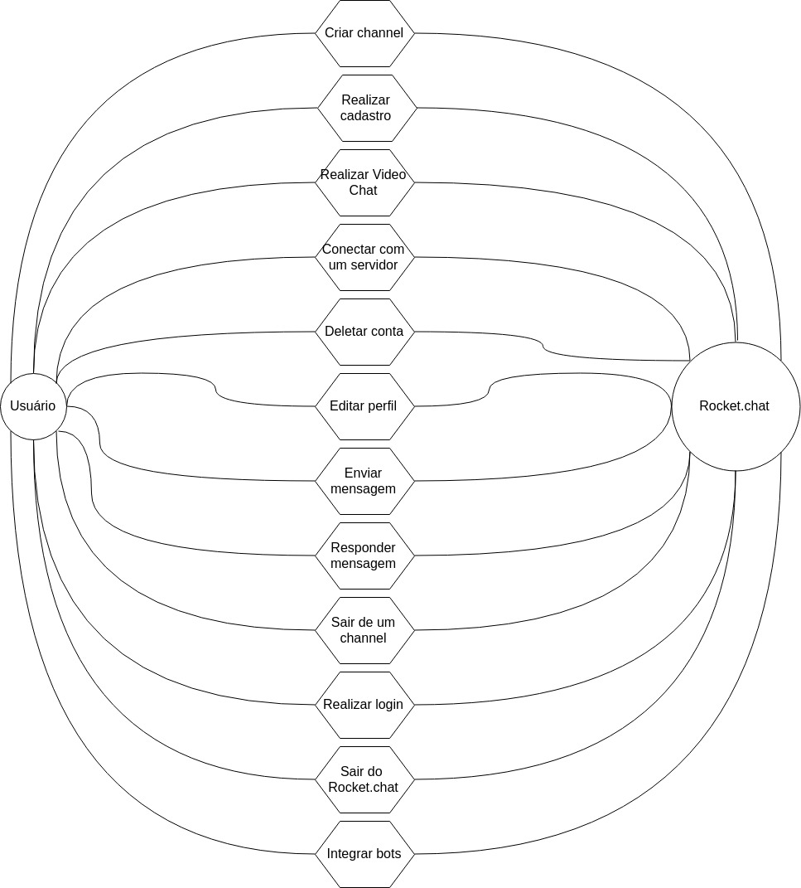

#### ISD03 - Sistema de Contas

#### Versão 01
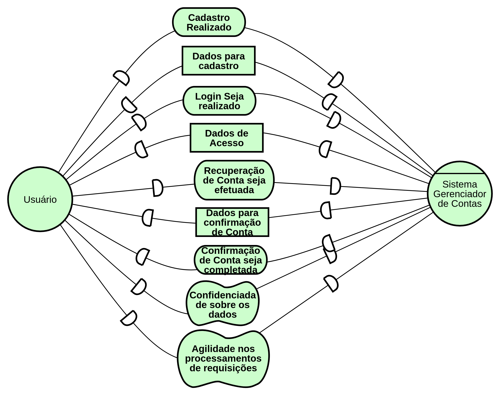

#### ISD04 - Ações sobre o channel

#### Versão 01

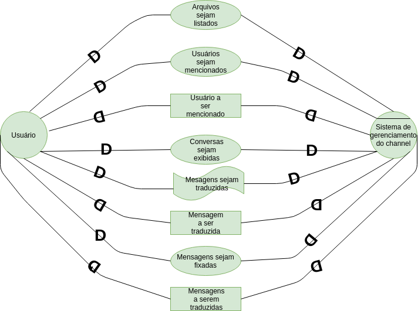

#### ISD05 - Contribuição da comunidade

#### Versão 01

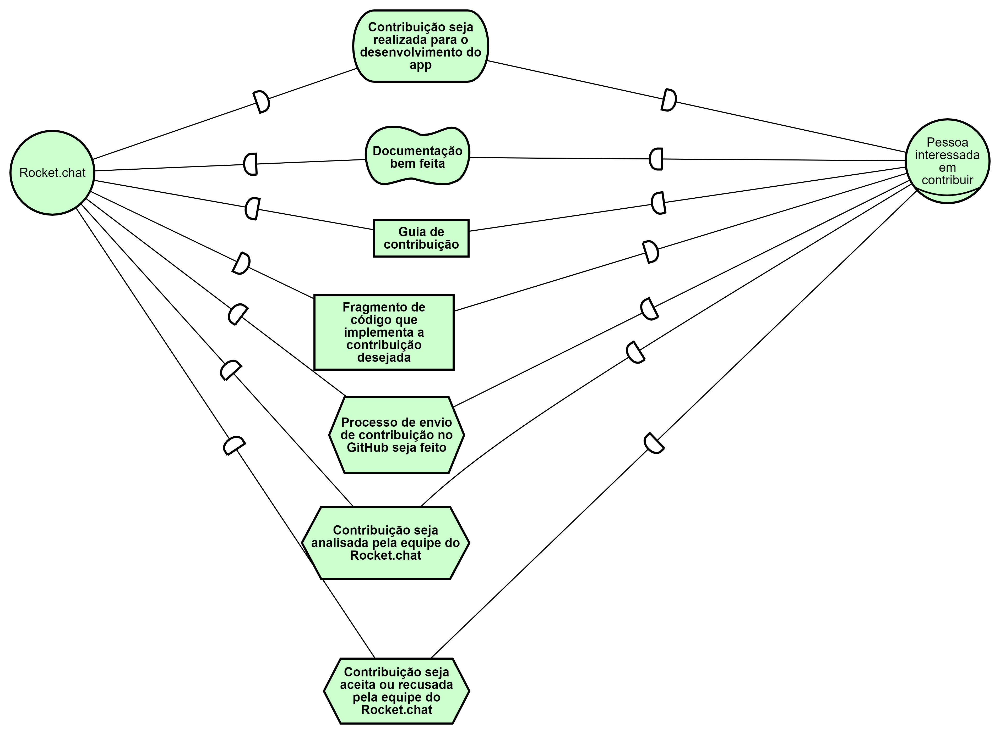

#### ISD06 - Videochamada

#### Versão 01

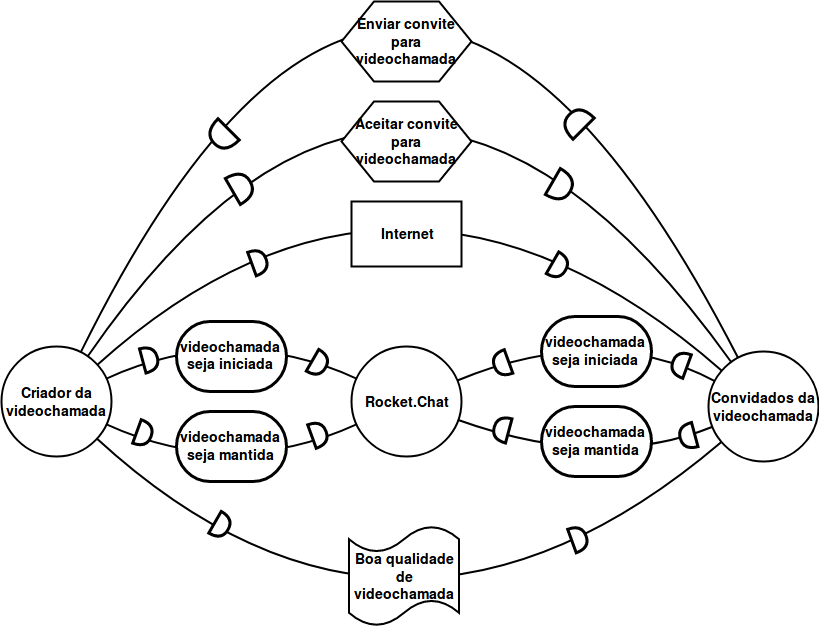

## Strategic Rationale Models

#### ISR01 - Criar channel

#### Versão 01

#### Versão 02
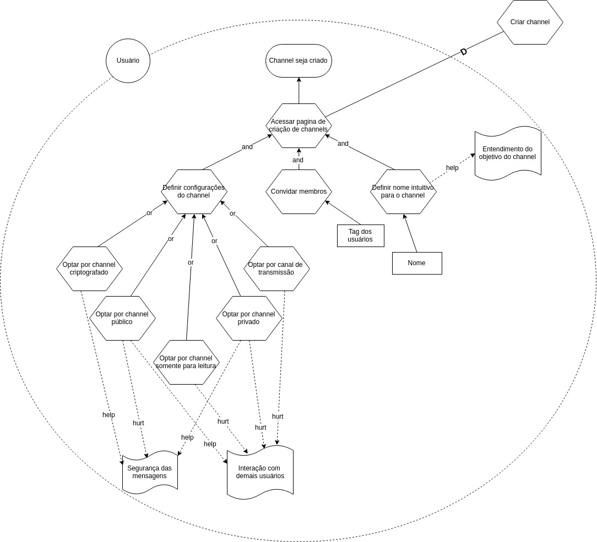

#### ISR02 - Realizar cadastro

#### Versão 01
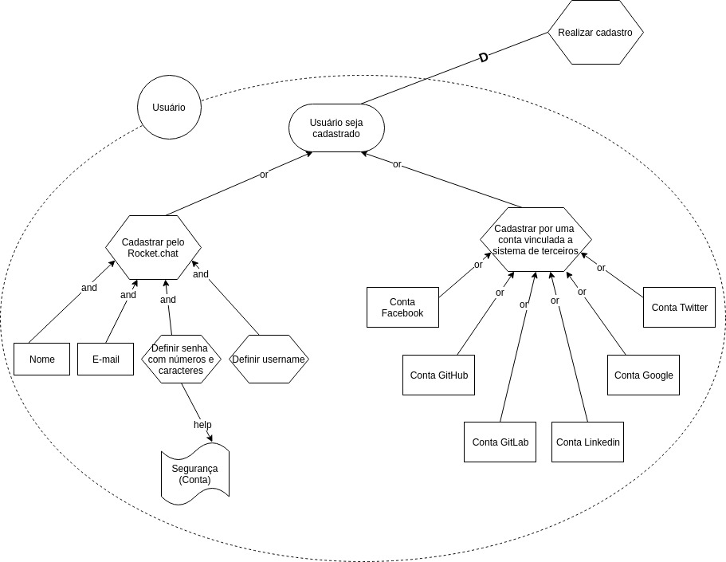

#### ISR03 - Envio de Mensagens

#### Versão 01
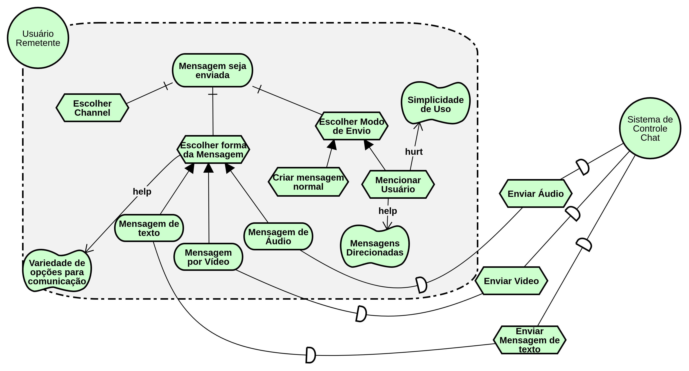

#### Versão 02

Versão refatorada após o artefato ter sido reprovado de acordo com a análise [IISR-03](../Análise/IStar.md#iisr-03)

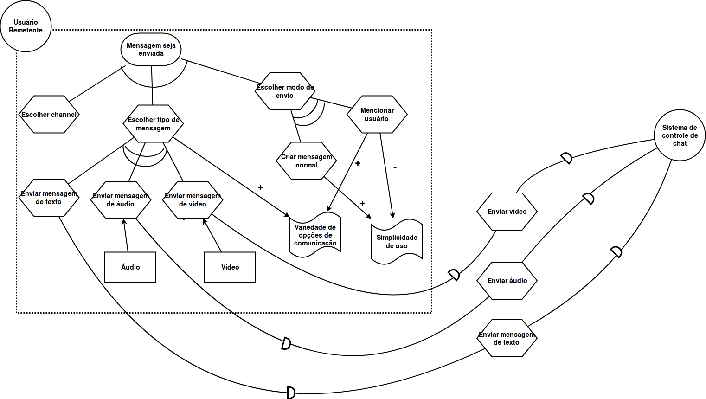

#### ISR04 - Ações sobre as Mensagens

#### Versão 01
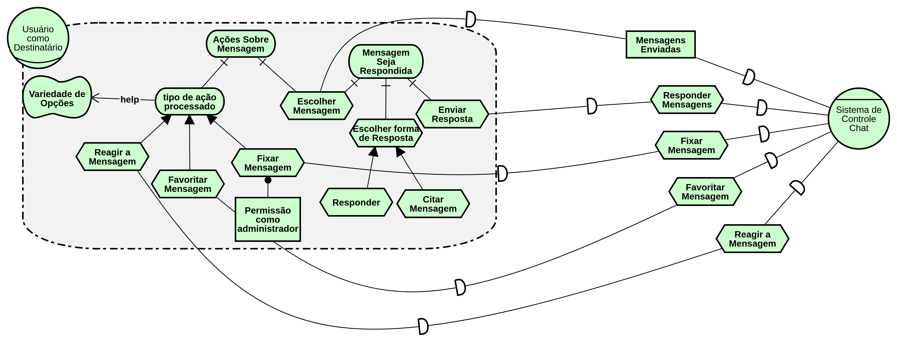

#### Versão 02

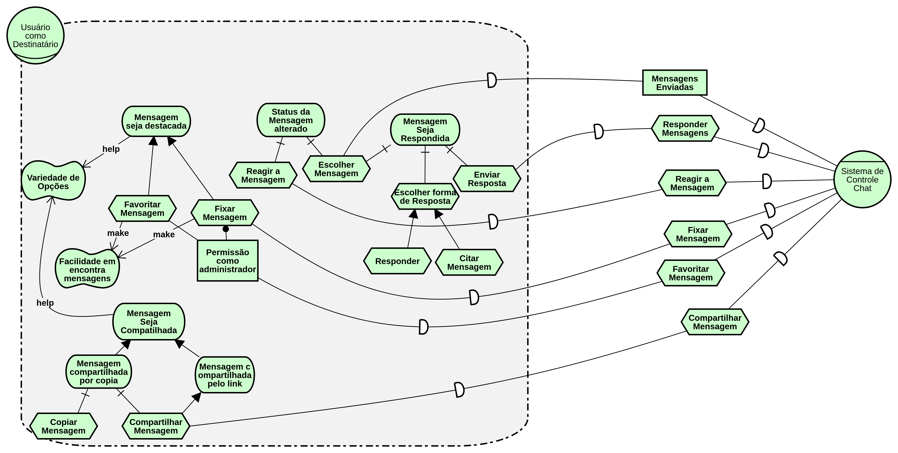

#### ISR05 - Ações sobre o Channel

#### Versão 01

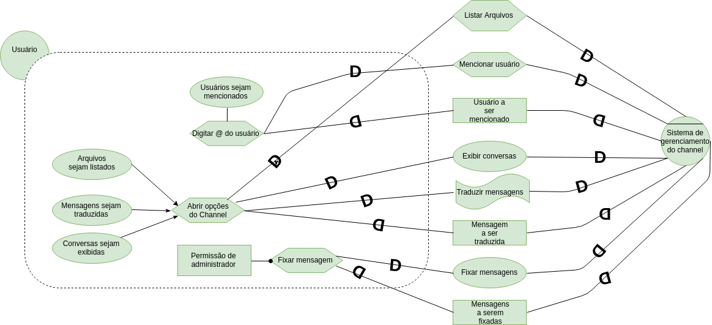

#### ISR06 - Contribuição da comunidade

#### Versão 01

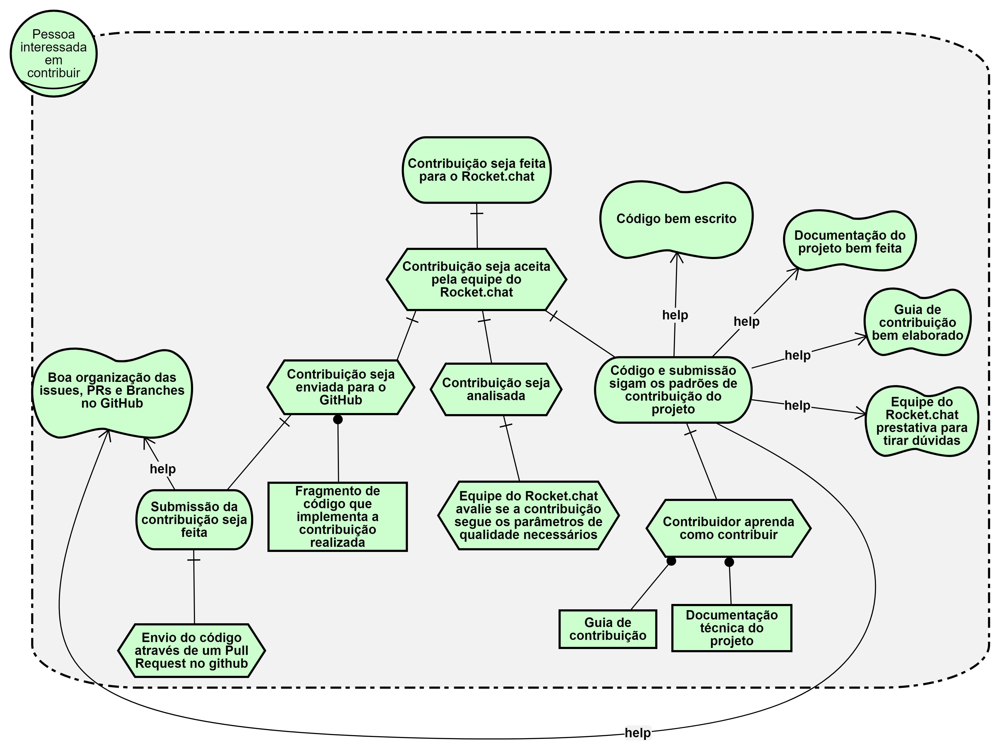

#### Versão 02

Versão refatorada após o artefato ter sido reprovado de acordo com a análise [IISR-06](../Análise/IStar.md#iisr-06)

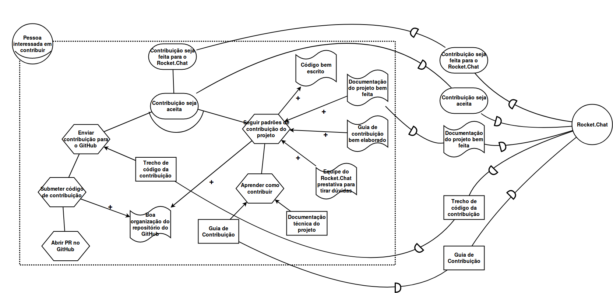

#### ISR07 - Videochamada

#### Versão 01

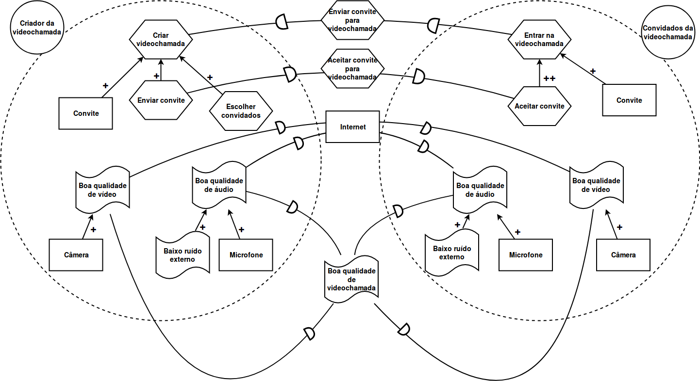

## Versionamento

| Data | Versão | Modificação | Autor |
|  --- | ------ | ----------- | ----- |
| 26/05/2019 | 1.0 | Abertura do documento | Lucas Maciel |
| 26/05/2019 | 1.1 | Adição do ISD01 - V1 | Lucas Maciel |
| 26/05/2019 | 1.2 | Adição dos ISD02 - V1, ISR01 - V1, ISR02 - V1 | Heron Rodrigues |
| 27/05/2019 | 1.3 | Adição do ISR03 - V1 | Lucas Maciel |
| 27/05/2019 | 1.4 | Adição do ISR04 - V1 | Lucas Maciel |
| 27/05/2019 | 1.5 | Atualização do ISR04 - V2 e ISD01 - V2 e adição ISD03 - V1 | Lucas MAciel |
| 29/05/2019 | 1.6 | Adição do ISR01 - V2 | Heron Rodrigues |
| 29/05/2019 | 1.7 | Adição do ISD02 - V2 | Heron Rodrigues |
| 29/05/2019 | 1.8 | Adição de ISD04 - V1 | João Lucas |
| 29/05/2019 | 1.9 | Adição de ISR05 - V1 | João Lucas |
| 29/05/2019 | 1.9 | Adição de ISD05 - V1 | Marcos Nery |
| 29/05/2019 | 2.0 | Adição de ISR06 - V1 | Marcos Nery |
| 29/05/2019 | 2.1 | Adição de ISD06 - V1 e ISR07 - V1 | Weiller Fernandes |
| 24/06/2019 | 2.2 | Adição de ISR03 - V2 e ISR06 - V2 | Weiller Fernandes |
