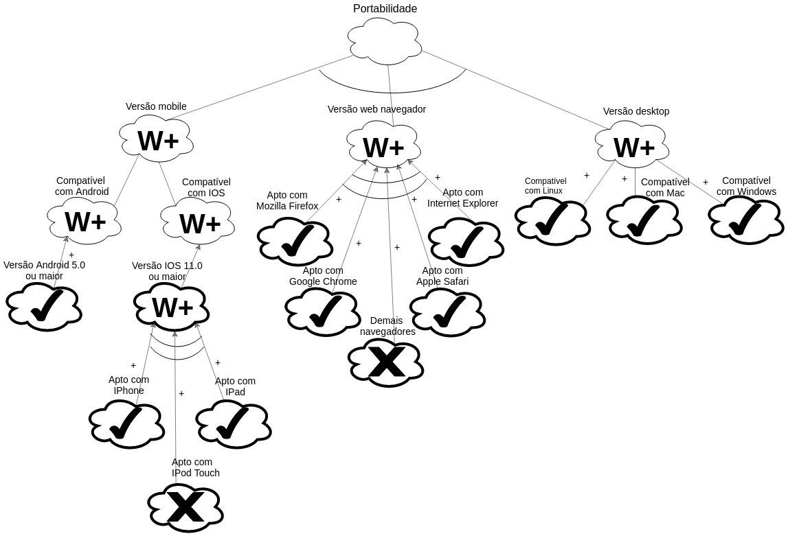

# NFR Framework

O NFR é um framework orientado a metas, que busca representar requisitos não funcionais de um sistema de software. Utilizando o modelo Softgoal Interdependency Graph (SIG). Desse modelo é abstraído um diagrama formado por softgoals (requisitos de qualidade), operacionalização, argumentação, impactos e legenda.

## NFR1 - Portabilidade

### Versão 01

## NFR2 - Performance do Chat

### Versão 01

## Versionamento

| Data | Versão | Modificação | Autor |
|  :------: | :------: | :------: | :------: |
| 25/05/2019 | 1.0 | Abertura do documento | Heron Rodrigues |
| 25/05/2019 | 1.1 | Adição do NFR01 - Versão 01 | Heron Rodrigues |
| 26/05/2019 | 1.2 | Adição do NFRO2 - Versão 01 | Lucas Maciel |
