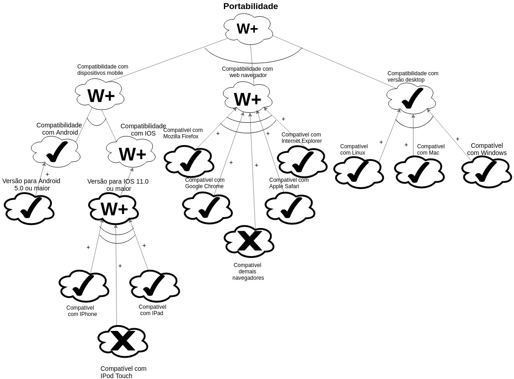
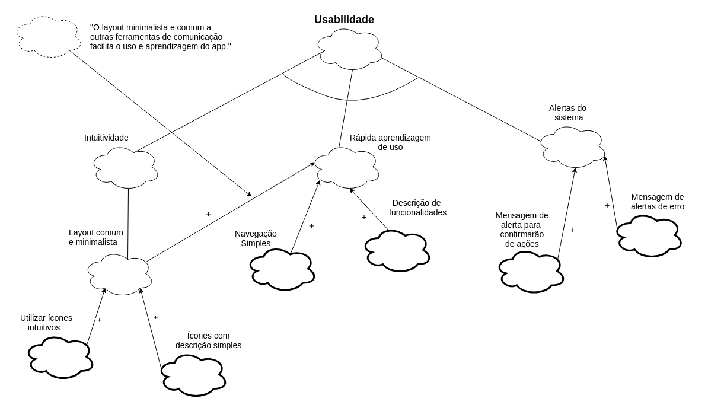
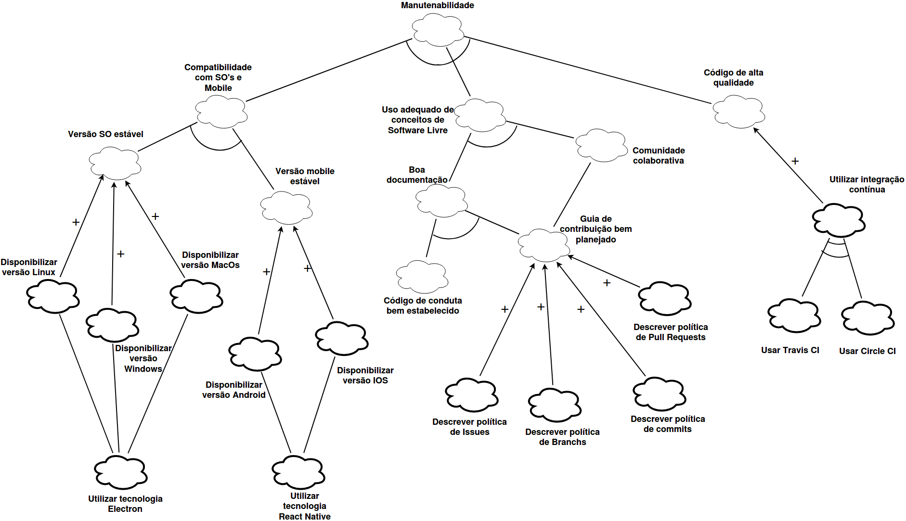

# NFR Framework

O NFR é um framework orientado a metas, que busca representar requisitos não funcionais de um sistema de software. Utilizando o modelo Softgoal Interdependency Graph (SIG). Desse modelo é abstraído um diagrama formado por softgoals (requisitos de qualidade), operacionalização, argumentação, impactos e legenda.

## NFR1 - Portabilidade

### Versão 01

#### Análise

### Versão 02

#### SIG

#### Análise

## NFR2 - Performance do Chat

### Versão 01

#### Análise

### Versão 02

#### SIG

#### Análise

## NFR3 - Suporte

### Versão 01

#### Análise

### Versão 02

#### SIG

#### Análise

## NFR4 - Usabilidade

### Versão 01

#### SIG

#### Análise

## NFR5 - Personabilidade

### Versão 01

#### SIG

#### Análise

### Versão 02

#### SIG

#### Análise

## NFR6 - Segurança

### Versão 01

#### Análise

## NFR07 - Manutenabilidade

### Versão 01

#### SIG

#### Análise

### Versão 02

Versão refatorada após o artefato ter sido reprovado de acordo com a análise [INFR-07](../Análise/NFR.md#infr-07)

#### SIG

#### Análise

## NFR08 - Contribuição da comunidade

### Versão 01

#### SIG

#### Análise

## Relacionamento 01

### Versão 01

#### Análise

## NFR09 - Conectividade

### Versão 01

#### SIG

#### Análise

### Versão 02

Versão refatorada após o artefato ter sido reprovado de acordo com a análise [INFR-09](../Análise/NFR.md#infr-09)

#### SIG

#### Análise

## Versionamento

| Data | Versão | Modificação | Autor |
|  --- | ------ | ----------- | ----- |
| 25/05/2019 | 1.0 | Abertura do documento | Heron Rodrigues |
| 25/05/2019 | 1.1 | Adição do NFR1 - Versão 01 | Heron Rodrigues |
| 26/05/2019 | 1.2 | Adição do NFR2 - Versão 01 | Lucas Maciel |
| 26/05/2019 | 1.3 | Adição do NFR3 - Versão 01 | Heron Rodrigues |
| 26/05/2019 | 1.4 | Adição do NFR4 - Análise - Versão 01 | André Lucas |
| 26/05/2019 | 1.5 | Adição do NFR5 - Versão 01 | Weiller Fernandes |
| 27/05/2019 | 1.6 | Adição do NFR6 - Versão 01 | Lucas Maciel |
| 28/05/2019 | 1.7 | Adição do NFR1 - Versão 02 | Heron Rodrigues |
| 28/05/2019 | 1.8 | Adição do NFR5 - Versão 02 | Weiller Fernandes |
| 29/05/2019 | 1.9 | Adição do NFR3 - Versão 02 | Heron Rodrigues |
| 29/05/2019 | 2.0 | Adição do Relacionamento 01 | Heron Rodrigues |
| 29/05/2019 | 2.1 | Adição do NFR7 - Versão 01 | João Lucas |
| 29/05/2019 | 2.2 | Adição do NFR7 - Versão 02 | João Lucas |
| 29/05/2019 | 2.3 | Adição do NFR8 - Versão 01 | Marcos Nery |
| 29/05/2019 | 2.4 | Adição do NFR8 - Análise | Marcos Nery |
| 29/05/2019 | 2.5 | Adição do NFR2 - Versão 02 | Lucas Maciel |
| 29/05/2019 | 2.6 | Adição do NFR04 - Versão 01 | André Lucas |
| 29/05/2019 | 2.7 | Adição do NFR09 - Versão 01 | Gabriel Davi |
| 22/06/2019 | 2.8 | Padronizando títulos | Weiller Fernandes |
| 23/06/2019 | 2.9 | Adição do NFR7 - V2 e NFR9 - V2 | Weiller Fernandes |
