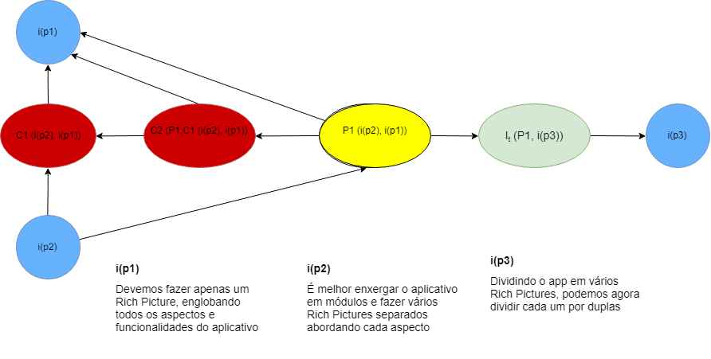

## Introdução

A argumentação se define por uma troca de palavras em forma de argumentos em meio a uma discussão na busca de se chegar a uma conclusão sobre algo. A partir disso, foram montadas técnicas de pré-rastreabilidade que constroem artefatos formais cujo objetivo é mostrar o progresso de decisão entre diferentes opiniões a respeito do produto ou do projeto. Nesse caso, está sendo usado o framework ACE para montar os diagramas de argumentação, que é focado em verificar a validação relativa dos artefatos discutidos.

## AR1 - Escolha do app
Diagrama de argumentação baseado na discussão para escolha do app que seria abordado pela equipe na disciplina. Na qual ficou decidido que o App sobre o qual fariamos os trabalhos seria o Rocket Chat.

## AR2 - Rich Picture

Esse diagrama foi baseado na discussão que o grupo teve acerca de como construir o Rich Picture da aplicação.

## AR3 - Novo Membro

Diagrama de argumentação baseada na discussão que o grupo teve sobre procurar ou não um novo membro, após um integrande do time sair.

## Versionamento

|  Versão | Data | Modificação | Autor |
|  :------: | :------: | :------: | :------: |
|  1.0 | 28/03/2019 | Adição da [AR2](#ar2-rich-picture) | Todo grupo |
|  1.1 | 31/03/2019 | Adição da [AR1](#ar1-escolha-do-app) | Todo grupo |
|  1.2 | 31/03/2019 | Adição da [AR3](#ar3-novo-membro) | Todo grupo |
