## Introdução

O Rich Picture é uma técnica que gera um artefato de grau inferior de formalidade, que busca construir pré-rastreabilidade através de desenhos ou diagramas, feitos a mão ou digitalmente, expressando ideias ou funcionalidades e relações entre sistemas e subsistemas. Justamente por ser menos formal, muitas vezes servindo para transparecer a compreensão do problema através da visão dos vários envolvidos, que podem ajudar na criação dos diagramas sem precisar de nenhum conhecimento prévio.

Como explicado no documento de estratégia, dividimos o escopo geral do aplicativo em 4 grandes grupos, sendo eles: Geral, Chats, Configuração + Perfil  e Externo.

## RP1 - Externo

O escopo definido como Externo ilustra todos os fatores e interações fora da plataforma. Bem como fluxo de caixa, investidores, desenvolvedores, servidores, concorrentes, comunidade open source e afins.

Rich Picture - Externo v1.0

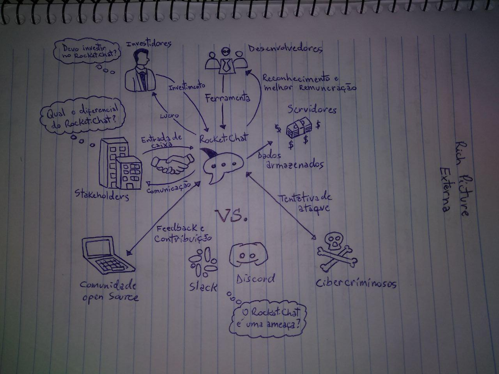

Rich Picture - Externo v1.1
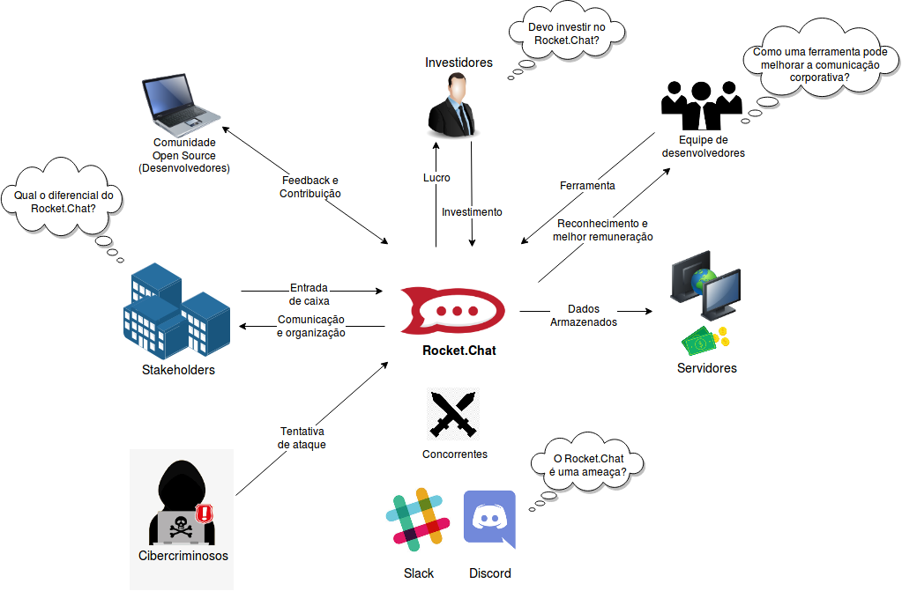

## RP2 - Geral

O escopo difinido como geral é a interação geral do usuário com as opções disponíveis na tela inicial do app, que são: Chats, Configuração, e Perfil. Para cada uma dessas opções disponíveis foram feitas Rich Pictures detalhando as funções.

Rich Picture - Geral v1.0
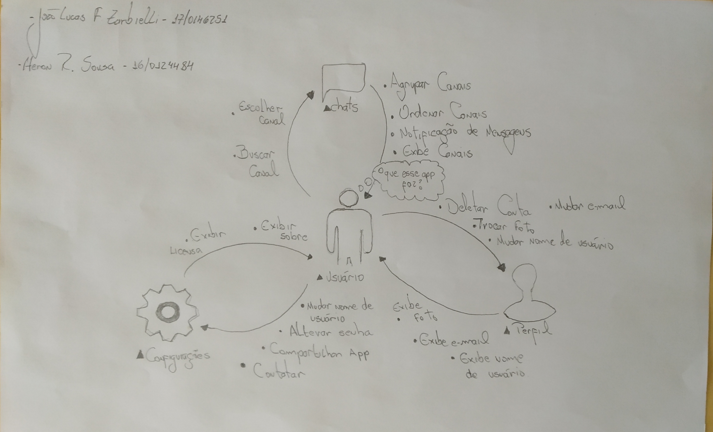

Rich Picture - Geral v1.1
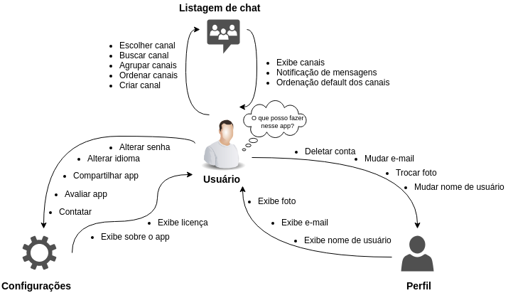

Rich Picture - Geral v2.0
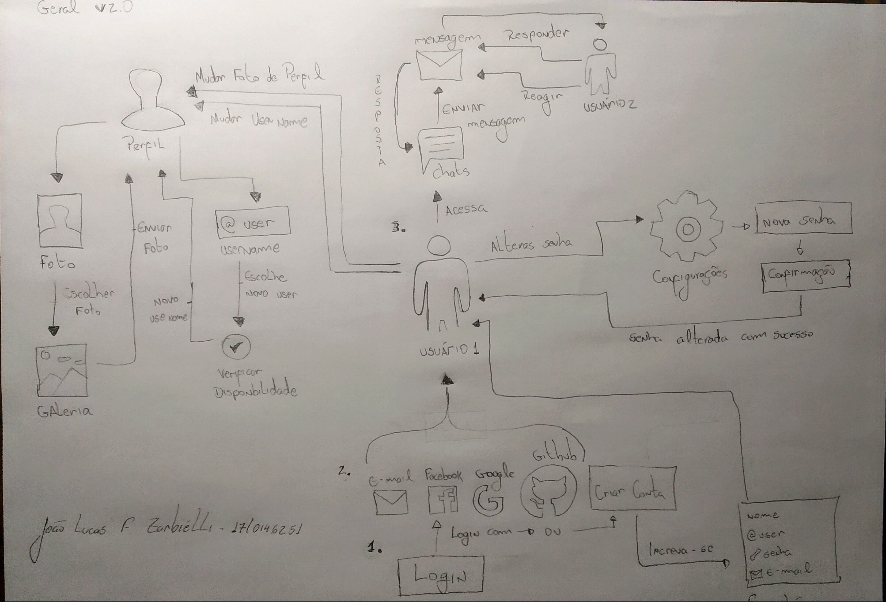

Rich Picture - Geral v2.1
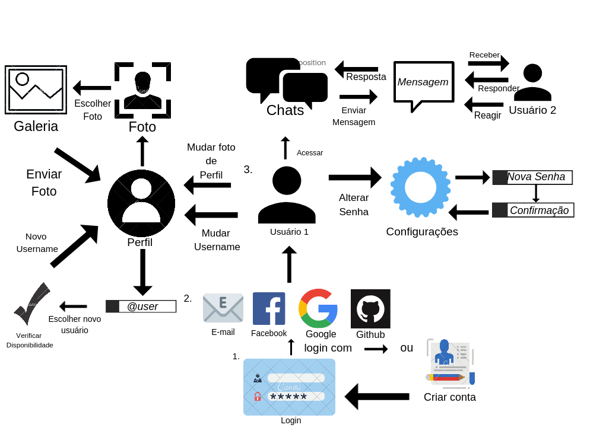

## RP3 - Channel

O escopo definido como Channel ilustra toda a interação dos usuários dentro das salas de conversa da plataforma, bem como seus benefícios e particularidades.

Rich Picture - Channel v1.0

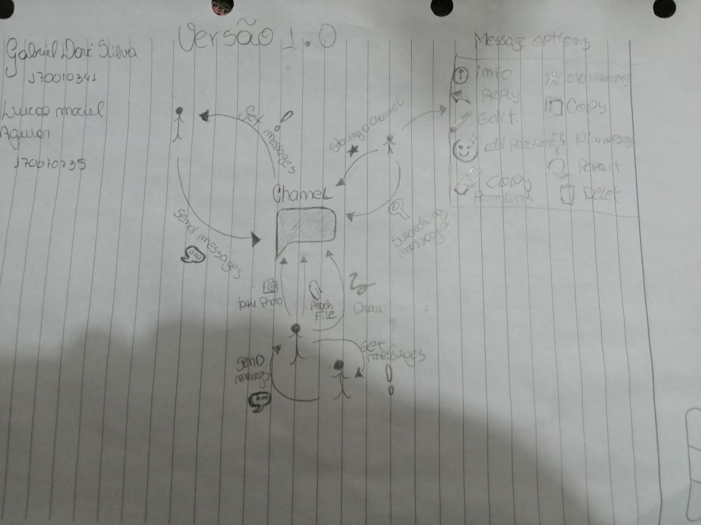

Rich Picture - Channel V1.1
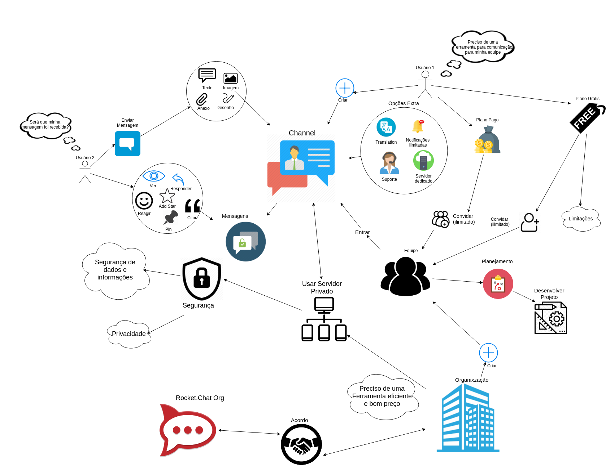

## RP4 - Menus de configuração e perfil do usuário

Aqui estão ilustradas as funcionalidades do menu de configurações da aplicação e das interações do usuário com seu perfil online.

Rich Picture - Config e Perfil v1.0

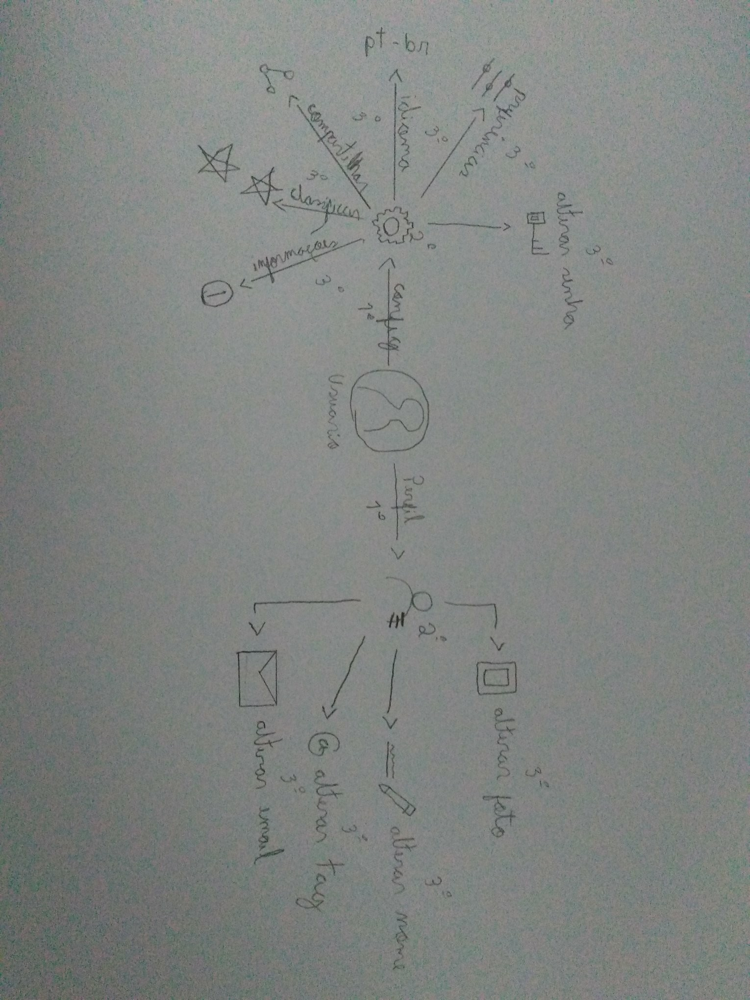

Rich Picture - Config e Perfil v1.1
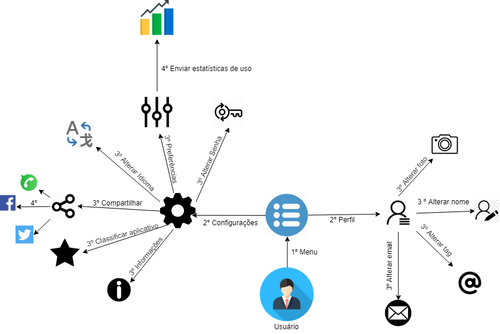

## RP5 - Como contribuir

Rocket chat é uma aplicação open source,  usuários da comunidade podem contribuir com o projeto. O rich picture a seguir tem como objetivo de ilustrar esse processo.

Rich Picture - Como contribuir v1.0

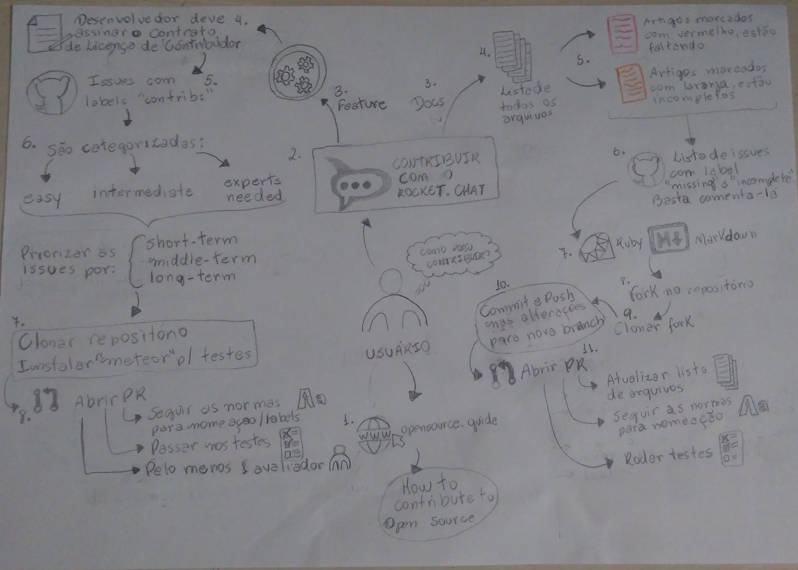

## Versionamento

|  Versão | Data | Modificação | Autor |
|  :------: | :------: | :------: | :------: |
|  0.1 | 31/03/2019 | Adição da [RP2](#rp2-geral) | João Lucas e Heron Sousa|
|  0.2 | 31/03/2019 | Adição da [RP3](#rp3-channel) | Gabriel Davi e Lucas Maciel|
|  0.3 | 31/03/2019 | Adição da [RP4](#rp4-menus-de-configuração-e-perfil-do-usuário) | Marcos Nery |
|  0.4 | 01/04/2019 | Adição da [RP1](#rp1-externo) | André Lucas e Weiller Fernandes |
|  0.5 | 02/04/2019 | Adição da [RP2](#rp2-geral)  | João Lucas |
|  0.6 | 05/04/2019 | Adição da [RP2](#rp2-geral)  | João Lucas |
|  0.7 | 05/04/2019 | Adição da [RP5](#rp5-contrib)  | Heron Sousa |
