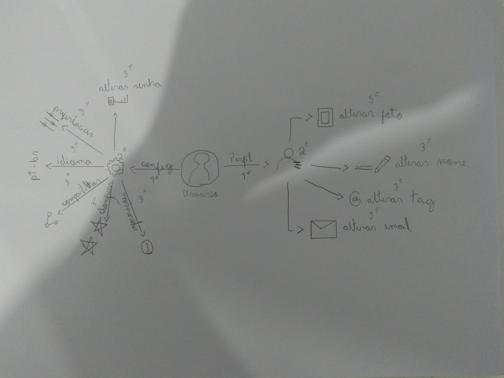

## Introdução

O Rich Picture é uma técnica que gera um artefato de grau inferior de formalidade, que busca construir pré-rastreabilidade através de desenhos ou diagramas, feitos a mão ou digitalmente, expressando ideias ou funcionalidades e relações entre sistemas e subsistemas. Justamente por ser menos formal, muitas vezes servindo para transparecer a compreensão do problema através da visão dos vários envolvidos, que podem ajudar na criação dos diagramas sem precisar de nenhum conhecimento prévio.

Como explicado no documento de estratégia, dividimos o escopo geral do aplicativo em 4 grandes grupos, sendo eles: Geral, Chats, Configuração + Perfil  e Externo.

## 1. Geral

O escopo difinido como geral é a interação geral do usuário com as opções disponíveis na tela inicial do app, que são: Chats, Configuração, e Perfil. Para cada uma dessas opções disponíveis foram feitas Rich Pictures detalhando as funções.

Rich Picture - Geral V1.

Rich Picture - Geral V2.

## 2. Channel

O escopo definido como Channel ilustra toda a interação dos usuários dentro das salas de conversa da plataforma, bem como seus benefícios e particularidades.

Rich Picture - Channel V1.

Rich Picture - Channel V2.

## 2. Menus de configuração e perfil do usuário

Aqui estão ilustradas as funcionalidades do menu de configurações da aplicação e das interações do usuário com seu perfil online.

Rich Picture - Config e Perfil V1.

Rich Picture - Config e Perfil V2.
