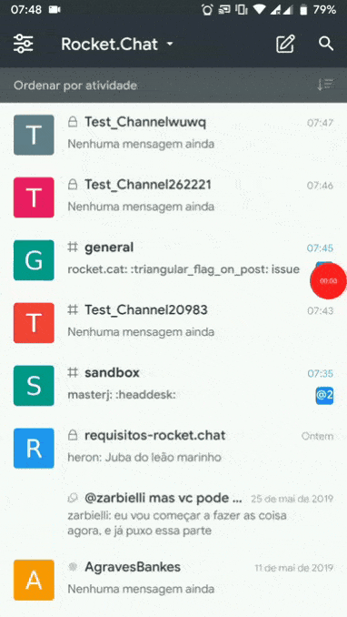

# Foward-From

Neste documento busca-se construir a matriz de pós-rastreabilidade através da ótica Foward-From. Foram feitas duas tabelas, a primeira para requisitos funcionais e a segunda para os não funcionais.

## Metodologia

Para o desenvolvimento do documento a seguir, a equipe decidiu separa-lo em duas tabelas, a primeira tabela com os requisitos funcionais e a segunda para os requisitos não-funcionais. Como vários membros da equipe iriam trabalhar no documento ao mesmo tempo, foram criadas duas tabelas no drive, para evitar a repetição de requisitos na tabela, que posteriormente seriam convertidas para formato markdown e colocadas na wikia. Link para as tabelas no drive: [funcionais](https://docs.google.com/spreadsheets/d/17uv-YxoEdDHEgwkEWWxdQUYqHkHEk-N381ivfJEQQyI/edit#gid=0) e [não-funcionais](https://docs.google.com/spreadsheets/d/1HN24HaJRe7yE16k5k425cvma3hwgEx9qS4XVkG3EEkM/edit#gid=0).

## Requisitos Funcionais

|Código|Descrição|Tema|Épico|US|Funcionalidade|Código|
|------|---------|----|-----|--|--------------|------|
|RF1 |Tradução instântanea para mensagens em línguas diferentes da padrão|[T04](../Modelagem/backlog.md#t04-channel)|[EP11](../Modelagem/backlog.md#ep11-acoes-do-channel)| [US45](../Modelagem/backlog.md#us45)|[Tradução](#rf1_gif)|[View](https://github.com/RocketChat/Rocket.Chat.ReactNative/blob/develop/app/views/RoomView/index.js)|
|RF2 |O aplicativo deve ser capaz de realizar videoconferências em  grupo|[T04](../Modelagem/backlog.md#t04-channel) | [EP11](../Modelagem/backlog.md#ep11-acoes-do-channel)|[US46](../Modelagem/backlog.md#us46)|[Videoconferência em grupo](#rf2_gif)|[Código - Método "livevideo"](https://github.com/RocketChat/Rocket.Chat.ReactNative/blob/develop/app/views/RoomActionsView/index.js)|
|RF3   |A aplicação deve oferecer ao usuário a possibilidade de entrar no app através de username e senha, previamente cadatrados no aplicativo      |[T01](../Modelagem/backlog.md#t01-entrar-no-aplicativo)|[EP01](Modelagem/backlog.md/#ep01-fazer-login)                                                                           |[US01](../Modelagem/backlog.md#us01)  [US02](../Modelagem/backlog.md#us02) |                                      [Login](#RF3_gif) | [View](https://github.com/RocketChat/Rocket.Chat.ReactNative/blob/develop/app/views/LoginView.js)   [Action](https://github.com/RocketChat/Rocket.Chat.ReactNative/blob/develop/app/actions/login.js)|
|RF4   |O app deve permitir o cadastro na aplicação por contas de serviços de terceiros ou a partir de dados do usuário, como email, username e senha|[T01](../Modelagem/backlog.md#t01-entrar-no-aplicativo)|[EP02](../Modelagem/backlog.md/#ep02-fazer-cadastro)                                                                     |[US03](../Modelagem/backlog.md#us03)  [US04](../Modelagem/backlog.md#us04)                                       |[Cadastro](#rf4_gif)  | [View](https://github.com/RocketChat/Rocket.Chat.ReactNative/blob/develop/app/views/RegisterView.js)  [Utils](https://github.com/RocketChat/Rocket.Chat.ReactNative/blob/develop/app/utils/isValidEmail.js)|
|RF5   |O usuário deve ter a disposição, a criação de canais, subgrupos de discussão e grupos, privados/publicos, ilimitados.| [T04](../Modelagem/backlog.md#t04-channel)                       |[EP08](../Modelagem/backlog.md/#ep08-criar-channel)                                                                      |[US18](../Modelagem/backlog.md#us18)   [US19](../Modelagem/backlog.md#us19)   [US21](../Modelagem/backlog.md#us21)      |[Criar channel](#rf5_gif)  | [View](https://github.com/RocketChat/Rocket.Chat.ReactNative/blob/develop/app/views/CreateChannelView.js)  [Action](https://github.com/RocketChat/Rocket.Chat.ReactNative/blob/develop/app/actions/createChannel.js) |
|RF6   |O usuário deve ser capaz de, dentro da plataforma, enviar mensagens dentro de grupos de conversa ou dentro de chats privados |[T04](../Modelagem/backlog.md#t04-channel)                |[EP08](../Modelagem/backlog.md/#ep08-criar-channel)                                                                      |[US20](../Modelagem/backlog.md#us20)                                                                               |[Enviar mensagem](#rf6_gif) | [Código - Método "sendMessage"](https://github.com/RocketChat/Rocket.Chat.ReactNative/blob/develop/app/views/RoomView/index.js)           |
|RF7   |O usuário deve ser capaz de realizar uma busca de uma mensagem dentro de um determinado chat                                                 |[T04](../Modelagem/backlog.md#t04-channel)|[EP11](../Modelagem/backlog.md#ep11-acoes-do-channel)                                                                      |[US48](../Modelagem/backlog.md#us48)                                                                               | [Procurar mensagem](#RF7_gif) | [Código - SearchMessages](https://github.com/RocketChat/Rocket.Chat.ReactNative/blob/develop/app/views/SearchMessagesView/index.js) |
|RF8   |O app deve oferecer a possibilidade do usuário instalar seu próprio servidor local. |[T05](../Modelagem/backlog.md#t05-servidor)|[EP16](../Modelagem/backlog.md#ep16-conectar-com-um-servidor)  |[US65](../Modelagem/backlog.md#us65) | [Servidor](#rf8_gif) ||
|RF9   |A plataforma deve permitir a integração de Bots|[T04](../Modelagem/backlog.md#t04-channel)|[EP14](../Modelagem/backlog.md#ep14-integrações) |[US62](../Modelagem/backlog.md#us62) |  [Bots](#rf9_gif) ||
|RF10  |A plataforma deve permitir a alteração nas configurações do app |[T03](../Modelagem/backlog.md#t03--visao-geral-do-aplicativo)|[EP05](../Modelagem/backlog.md#ep05-configurações-do-aplicativo)|[US09](../Modelagem/backlog.md#us09)| [Configurações do app](#rf10_gif) | [View](https://github.com/RocketChat/Rocket.Chat.ReacótNative/blob/develop/app/views/SettingsView/index.js)  [Action](https://github.com/RocketChat/Rocket.Chat.ReactNative/blob/develop/app/actions/markdown.js)  [Util](https://github.com/RocketChat/Rocket.Chat.ReactNative/blob/develop/app/utils/deviceInfo.js)  [Util](https://github.com/RocketChat/Rocket.Chat.ReactNative/blob/develop/app/utils/info.js)|
|RF11  |Possibilidade de alteração do idioma no aplicativo                                                                                           |[T03](../Modelagem/backlog.md#t03--visao-geral-do-aplicativo)|[EP05](../Modelagem/backlog.md#ep05-configurações-do-aplicativo)|[US09](../Modelagem/backlog.md#us09), [US10](../Modelagem/backlog.md#us10)                                      | [Alterar idioma](#rf11_gif)| [View](https://github.com/RocketChat/Rocket.Chat.ReactNative/blob/develop/app/views/LanguageView/index.js)  [Util](https://github.com/RocketChat/Rocket.Chat.ReactNative/blob/develop/app/utils/info.js)
|RF12  |Permitir usuario iniciar conexão com uma instância do Rocket.chat|[T05](../Modelagem/backlog.md##t05-servidor)|[EP16](../Modelagem/backlog.md#ep16-conectar-com-um-servidor)|[US65](../Modelagem/backlog.md#us10) |[Conectar com um  servidor](#rf12_gif)|[Código](https://github.com/RocketChat/Rocket.Chat.ReactNative/blob/develop/app/views/NewServerView.js)
|RF13  |Alteração de senha |[T03](../Modelagem/backlog.md#t03--visao-geral-do-aplicativo)|[EP05](../Modelagem/backlog.md#ep05-configurações-do-aplicativo)|[US12](../Modelagem/backlog.md#us12) | [Alterar senha](#rf13_gif)  |[Código - Método "newPassword"](https://github.com/RocketChat/Rocket.Chat.ReactNative/blob/develop/app/views/ProfileView/index.js)
|RF14  |Possibilidade de mencionar, um ou todos, os membros do grupo |[T04](../Modelagem/backlog.md#t04-channel)|[EP11](../Modelagem/backlog.md#ep11-acoes-do-channel) |[US43](../Modelagem/backlog.md#us43)|  [Mencionar](#rf14_gif) |[Código - Método "Mention"](https://github.com/RocketChat/Rocket.Chat.ReactNative/blob/develop/app/views/MessagesView/index.js)|
|RF15  |Sistema deve ser capaz de Adicionar autenticação de 2 Fatores  |[T03](../Modelagem/backlog.md#t03--visao-geral-do-aplicativo)|[EP06](../Modelagem/backlog.md#ep06-configurações-da-conta)|[US13](../Modelagem/backlog.md#us13) | [Autenticação 2 Fatores](#rf15_gif)|[View](https://github.com/RocketChat/Rocket.Chat.ReactNative/blob/develop/app/views/OAuthView.js)  [Util](https://github.com/RocketChat/Rocket.Chat.ReactNative/blob/develop/app/utils/deviceInfo.js)|
|RF16  |Sistema deve mostrar e permitir a edição das configurações da conta |[T03](../Modelagem/backlog.md#t03--visao-geral-do-aplicativo)|[EP05](../Modelagem/backlog.md#ep05-configurações-do-aplicativo)  [EP06](../Modelagem/backlog.md#ep06-configurações-da-conta)|[US09](../Modelagem/backlog.md#us09)   [US14](../Modelagem/backlog.md#us14) | [Editar conta](#rf16_gif)  | [View](https://github.com/RocketChat/Rocket.Chat.ReactNative/blob/develop/app/views/ProfileView/index.js)   [Util](https://github.com/RocketChat/Rocket.Chat.ReactNative/blob/develop/app/utils/info.js) |
|RF17  |O sistema deve permitir o envio de arquivos e documentos em um chat |[T04](../Modelagem/backlog.md#t04-channel)|[EP10](../Modelagem/backlog.md#ep10-mensagens)  |[US28](../Modelagem/backlog.md#us28)   [US33](../Modelagem/backlog.md#us33) |  [Envio de Arquivo](#rf17_gif) |[Código - Método "Files"](https://github.com/RocketChat/Rocket.Chat.ReactNative/blob/develop/app/views/MessagesView/index.js)|
|RF18  |Permitir a alteração do status do usuário                                                                                                    |[T03](../Modelagem/backlog.md#t03--visao-geral-do-aplicativo)|[EP06](../Modelagem/backlog.md#ep06-configurações-da-conta)                                                                |[US15](../Modelagem/backlog.md#us15)                                                                            | [Alterar status](#rf18_gif)  | [Código - Método "renderStatusItem"](https://github.com/RocketChat/Rocket.Chat.ReactNative/blob/develop/app/views/SidebarView/index.js)  |
|RF19  |App deve possuir ferramenta para busca de Channels                                                                                           |[T03](../Modelagem/backlog.md#t03--visao-geral-do-aplicativo)|[EP07](../Modelagem/backlog.md#ep07-channels)                                                                              |[US16](../Modelagem/backlog.md#us16)                                                                            | [Buscar channel](#rf_19_gif)  | [Código - Método "search"](https://github.com/RocketChat/Rocket.Chat.ReactNative/blob/develop/app/views/RoomsListView/index.js)   |
|RF20  |App deve possuir opções para listar Channels em categorias |[T03](../Modelagem/backlog.md#t03--visao-geral-do-aplicativo)|[EP07](../Modelagem/backlog.md#ep07-channels) |[US17](../Modelagem/backlog.md#us17) | [Ordenar por categoria](#rf20_gif)  | [Código - Método "groupByType"](https://github.com/RocketChat/Rocket.Chat.ReactNative/blob/develop/app/views/RoomsListView/index.js)    |
|RF21  |Possibilidade de favoritar um grupo |[T04](../Modelagem/backlog.md#t04-channel)|[EP11](../Modelagem/backlog.md#ep11-acoes-do-channel)|[US42](../Modelagem/backlog.md#us42)|  [Favoritar Channel](#rf21_gif)|[Código - Método "renderRole"](https://github.com/RocketChat/Rocket.Chat.ReactNative/blob/develop/app/views/RoomInfoView/index.js)|
|RF22  |Permitir a alteração de privacidade do Channel|[T04](../Modelagem/backlog.md#t04-channel)|[EP09](../Modelagem/backlog.md#ep09-configurações-do-channel) |[US22](../Modelagem/backlog.md#us22)| [Privacidade do Channel](#rf22_gif)|[Código - Método "renderType"](https://github.com/RocketChat/Rocket.Chat.ReactNative/blob/develop/app/views/CreateChannelView.js)|
|RF23  |Definir Channel como Read Only |[T04](../Modelagem/backlog.md#t04-channel)|[EP09](../Modelagem/backlog.md#ep09-configurações-do-channel) |[US23](../Modelagem/backlog.md#us23) |  [Read Only](#rf23_gif)|[Código - Método "renderReadOnly"](https://github.com/RocketChat/Rocket.Chat.ReactNative/blob/develop/app/views/CreateChannelView.js)|
|RF24  |Definir Channel para BroadCast |[T04](../Modelagem/backlog.md#t04-channel)|[EP09](../Modelagem/backlog.md#ep09-configurações-do-channel) |[US24](../Modelagem/backlog.md#us24) | [BroadCast](#rf24_gif) |[Código - Método "renderBroadcast"](https://github.com/RocketChat/Rocket.Chat.ReactNative/blob/develop/app/views/CreateChannelView.js)|
|RF25  |Permitir que o usuário possa adicionar ou visualizar as informações do Channel através de uma descrição, tópico do Channel |[T04](../Modelagem/backlog.md#t04-channel)|[EP09](../Modelagem/backlog.md#ep09-configurações-do-channel)    [EP11](../Modelagem/backlog.md#ep11-acoes-do-channel) |[US25](../Modelagem/backlog.md#us25)   [US26](../Modelagem/backlog.md#us26)   [US47](../Modelagem/backlog.md#us47)| [Adicionar descrição](#rf25_gif)   |[Código - Método "description"](https://github.com/RocketChat/Rocket.Chat.ReactNative/blob/develop/app/views/RoomInfoEditView/index.js) |
|RF26  |App deve permitir o envio de desenhos, como mensagens |[T04](../Modelagem/backlog.md#t04-channel)|[EP10](../Modelagem/backlog.md#ep10-mensagens) |[US30](../Modelagem/backlog.md#us30) | [Desenho](#rf26_gif) |[Código - Método "drawing"](https://github.com/RocketChat/Rocket.Chat.ReactNative/blob/develop/app/views/RoomView/index.js)|
|RF27  |O sistema deve permitir o envio de arquivos de midia, como vídeo e áudio |[T04](../Modelagem/backlog.md#t04-channel)|[EP10](../Modelagem/backlog.md#ep10-mensagens) |[US31](../Modelagem/backlog.md#us31) | [Midia](#rf27_gif) |[Código - Método "Files"](https://github.com/RocketChat/Rocket.Chat.ReactNative/blob/develop/app/views/MessagesView/index.js)|
|RF28  |O usuário deve poder editar suas mensagens enviadas |[T04](../Modelagem/backlog.md#t04-channel)|[EP10](../Modelagem/backlog.md#ep10-mensagens) |[US34](../Modelagem/backlog.md#us34) | [Editar Mensagens](#rf28_gif) |[Código - Método "editing"](https://github.com/RocketChat/Rocket.Chat.ReactNative/blob/develop/app/views/RoomView/index.js)|
|RF29  |O usuário deve poder copiar uma mensagem |[T04](../Modelagem/backlog.md#t04-channel)|[EP10](../Modelagem/backlog.md#ep10-mensagens) |[US35](../Modelagem/backlog.md.md#us35) | [Copiar Mensagem](#rf29_gif) |[Código - Método "copying"](https://github.com/RocketChat/Rocket.Chat.ReactNative/blob/develop/app/views/RoomView/index.js)|
|RF30  |O sistema deve oferecer uma maneira para o usuário possa compartilhar mensagens |[T04](../Modelagem/backlog.md#t04-channel)|[EP10](../Modelagem/backlog.md#ep10-mensagens) |[US36](../Modelagem/backlog.md#us36) | [Compartilhar Mensagens](#rf30_gif) |[Código - Método "sharing"](https://github.com/RocketChat/Rocket.Chat.ReactNative/blob/develop/app/views/RoomView/index.js)|
|RF31  |O usuário deve ter a possibilidade excluir uma mensagem a qualquer momento |[T04](../Modelagem/backlog.md#t04-channel)|[EP10](../Modelagem/backlog.md#ep10-mensagens) |[US38](../Modelagem/backlog.md#us38) | [Excluir Mensagem](#rf31_gif) |[Código - Método "deleteMessage"](https://github.com/RocketChat/Rocket.Chat.ReactNative/blob/develop/app/views/RoomView/index.js)|
|RF32  |Usuário deve poder adicionar reações a mensagens |[T04](../Modelagem/backlog.md#t04-channel)|[EP10](../Modelagem/backlog.md#ep10-mensagens) |[US39](../Modelagem/backlog.md#us39) | [Adicionar reação a mensagens](#rf32_gif)   |[Código - Método "onReactionPress"](https://github.com/RocketChat/Rocket.Chat.ReactNative/blob/develop/app/views/RoomView/index.js)   [Código](https://github.com/RocketChat/Rocket.Chat.ReactNative/blob/develop/app/containers/ReactionsModal.js) |
|RF33  |Usuário deve ser capaz de responder mensagens enviadas dentro de Channels que ele participa |[T04](../Modelagem/backlog.md#t04-channel)|[EP10](../Modelagem/backlog.md#ep10-mensagens) |[US40](../Modelagem/backlog.md#us40) | [Responder Mensagem](#rf33_gif) |[Código - Método "replying"](https://github.com/RocketChat/Rocket.Chat.ReactNative/blob/develop/app/views/RoomView/index.js)|
|RF34  |Usuário deve ter a possibilidade de reportar alguma mensagem em um Channel que não respeite as diretrizes do app |[T04](../Modelagem/backlog.md#t04-channel)|[EP10](../Modelagem/backlog.md#ep10-mensagens) |[US41](../Modelagem/backlog.md#us41) | [Reportar Mensagem](#rf34_gif)|[Código - Método "reporting"](https://github.com/RocketChat/Rocket.Chat.ReactNative/blob/develop/app/views/RoomView/index.js)|
| RF35   | O sistema deve ser capaz de exibir notificações para mensagens não lidas e  para menções em chats e possibilitar ao usuário a configuração das mesmas| [T04](../Modelagem/backlog.md#t04-channel) | [EP11](../Modelagem/backlog.md#ep11-acoes-do-channel) | [US44](../Modelagem/backlog.md#us44) | [Notificações](#rf35_gif) | [Código - Método "toggleNotifications"](https://github.com/RocketChat/Rocket.Chat.ReactNative/blob/develop/app/views/RoomActionsView/index.js) |
|RF36  |A aplicação deve fornecer suporte aos seus usuários via chat e e-mail.|[T02](../Modelagem/backlog.md#t02-ajuda-ao-usuario)|[EP03](../Modelagem/backlog.md/#ep02-atendimento-online)|[US05](../Modelagem/backlog.md#us05)    [US06](../Modelagem/backlog.md#us06) |[Suporte](#rf36_gif) |[Código - Método "sendEmail"](https://github.com/RocketChat/Rocket.Chat.ReactNative/blob/develop/app/views/SettingsView/index.js)|
| R37    | O app deve oferecer a possibilidade do usuário procurar mensagens por texto |  [T04](../Modelagem/backlog.md#t04-channel) | [EP11](../Modelagem/backlog.md#ep11-acoes-do-channel) | [US48](../Modelagem/backlog.md#us48) | [Procurar mensagens](#rf37_gif) | [Código - Método "searchText"](https://github.com/RocketChat/Rocket.Chat.ReactNative/blob/develop/app/views/RoomsListView/index.js) |
| R38    | O Sistema deve permitir que o usuário favorite uma mensagem  | [T04](../Modelagem/backlog.md#t04-channel) | [EP11](../Modelagem/backlog.md#ep11-acoes-do-channel)| [US49](../Modelagem/backlog.md#us49) | [Favoritar mensagem](#rf38_gif) | |
| R39    | O Sistema deve permitir que o usuário possa fixar uma mensagem no Channel | [T04](../Modelagem/backlog.md#t04-channel) | [EP11](../Modelagem/backlog.md#ep11-acoes-do-channel) | [US50](../Modelagem/backlog.md#us50) | [Fixar mensagem](#rf39_gif) ||
| R40    | O Usuário deve conseguir convidar membros do Channel para o Video Chat |  [T04](../Modelagem/backlog.md#t04-channel) | [EP12](../Modelagem/backlog.md#ep12-video-chat) | [US53](../Modelagem/backlog.md#us53) | [Convidar membros para video chat](#rf40_gif) |  |
| R41    | O Sistema deve permitir que o usuário possa compartilhar a tela de seu dispositivo |[T04](../Modelagem/backlog.md#t04-channel) | [EP12](../Modelagem/backlog.md#ep12-video-chat)| [US57](../Modelagem/backlog.md#us57) | [Compartilhar tela](#rf41_gif) | |
| R42    | A aplicação deve permitir que o usuário possa visualizar a lista de membros do Channel  |[T04](../Modelagem/backlog.md#t04-channel) | [EP13](../Modelagem/backlog.md#ep13-gerenciar-usuarios)| [US58](../Modelagem/backlog.md#us58) | [Visualizar membros](#rf42_gif) | [Código - Método "Members"](https://github.com/RocketChat/Rocket.Chat.ReactNative/blob/develop/app/views/MessagesView/index.js) |
| R43    | A Aplicação deve permitir que o usuário possa visualizar informações básicas de outro usuário |[T04](../Modelagem/backlog.md#t04-channel) | [EP13](../Modelagem/backlog.md#ep13-gerenciar-usuarios)| [US59](../Modelagem/backlog.md#us59) | [Visualizar informações de usuários](#rf43_gif) | |
| R44    | A Aplicação deve permitir que os usuários administradores do Channel possam adicionar novos usuários |[T04](../Modelagem/backlog.md#t04-channel) | [EP13](../Modelagem/backlog.md#ep13-gerenciar-usuarios)| [US60](../Modelagem/backlog.md#us60) | [Adicionar membros](#rf44_gif) | [Código - Método "canAddUser"](https://github.com/RocketChat/Rocket.Chat.ReactNative/blob/develop/app/views/RoomActionsView/index.js) |
| R45    | A Aplicaçaõ deve permitir que os usuários administradores do Channel possam remover usuários |[T04](../Modelagem/backlog.md#t04-channel) | [EP13](../Modelagem/backlog.md#ep13-gerenciar-usuarios)| [US61](../Modelagem/backlog.md#us61) | [Remover membros](#rf45_gif) | |
| R46    | A Aplicação deve permitir que os usuários possam esconder um Channel |[T04](../Modelagem/backlog.md#t04-channel) | [EP15](../Modelagem/backlog.md#ep15-deixar-channel)| [US63](../Modelagem/backlog.md#us63) | [Esconder channel](#rf46_gif) | |
| R47    | A Aplicação deve permitir que os usuários possam deixar um Channel |[T04](../Modelagem/backlog.md#t04-channel) | [EP15](../Modelagem/backlog.md#ep15-deixar-channel)| [US64](../Modelagem/backlog.md#us64)  [US63](../Modelagem/backlog.md#us63) | [Deixar channel](#rf47_gif) | [Código - Método "leaveChannel"](https://github.com/RocketChat/Rocket.Chat.ReactNative/blob/develop/app/views/RoomActionsView/index.js)   [Action - Método "leaveRoom"](https://github.com/RocketChat/Rocket.Chat.ReactNative/blob/develop/app/actions/room.js)|
| R48    | O Sistema deve permitir que um usuário possa visualizar todos os Channels visiveis do Servidor |[T04](../Modelagem/backlog.md#t04-channel) | [EP15](../Modelagem/backlog.md#ep19-diretorio) |[US69](../Modelagem/backlog.md#us69)  | [Visualizar channels](#rf48_gif) |[View](https://github.com/RocketChat/Rocket.Chat.ReactNative/blob/develop/app/views/RoomsListView/index.js)   [Action](https://github.com/RocketChat/Rocket.Chat.ReactNative/blob/develop/app/actions/server.js)   [Util](https://github.com/RocketChat/Rocket.Chat.ReactNative/blob/develop/app/utils/deviceInfo.js) |
| R49    | O Sistema deve permitir que um usuário possa visualizar a lista com todos os usuários do Servidor |[T04](../Modelagem/backlog.md#t04-channel) | [EP15](../Modelagem/backlog.md#ep19-diretorio)| [US70](../Modelagem/backlog.md#us70) | [Visualizar usuários de um servidor](#rf49_gif) | |
| RF50   | Sistema deve permitir que o usuário visualize as lista de arquivos enviados no channel |[T04](../Modelagem/backlog.md#t04-channel)|[EP10](../Modelagem/backlog.md#ep10-mensagens)| [US51](../Modelagem/backlog.md#us51) | [Visualizar arquivos enviados](#rf50_gif) | [Código - Método "Files"](https://github.com/RocketChat/Rocket.Chat.ReactNative/blob/develop/app/views/MessagesView/index.js) |

## Requisitos Não-Funcionais

|Código|Descrição                                                                                                                    |NFR                                                          |Operacionalizações                                                                                              |Funcionalidade                                                                                                                                                                |
|------|-----------------------------------------------------------------------------------------------------------------------------|-------------------------------------------------------------|----------------------------------------------------------------------------------------------------------------|------------------------------------------------------------------------------------------------------------------------------------------------------------------------------|
|RNF1  |A aplicação deve ser capaz de ser executada em diversas plataformas                                                          |[NFR-Portabilidade](../Modelagem/nfr.md#nfr1-portabilidade)  |"Acesso por aplicação mobile".  "Acesso por aplicação web";  "Acesso por aplicação desktop";                    |[Plataformas](#rnf1)                                                                                                                                                              |
|RNF2  |O Rocket.chat deve ofecer suporte tanto para a aplicação, em diversas arquiteturas, como para o usuário                      |[NFR-03](../Modelagem/nfr.md#nfr3-suporte)                   |"Documentação" "Suporte online"                                                                                 |    [Suporte](#rnf2)                                                                                                                                                                          |
|RNF3  |Deve ser uma plataforma que ofereça segurança com dados dos usuários.                                                        |[NFR-03](../Modelagem/nfr.md#nfr3-suporte)                   |"Criptografia ponta a ponta" "Backup de dados"                                                                  |                                                                                                                                                                              |
|RNF4  |O Rocket.chat deve estar disponível na maior quantidade possível de idiomas                                                  |[NFR-05](../Modelagem/nfr.md#nfr5-personabilidade)           |"Traduzir todos os menus do app para diferentes linguagens" "permitir a escolha de nova linguagem dentro do app"|                [Idiomas](#rnf4)                                                                                                                                                              |
|RNF5  |O Rocket.chat deve ter uma boa interface visual, minimalista e intuitiva, facilitando a usabilidade do usuário.              |[NFR-04](../Modelagem/nfr.md#nfr4-usabilidade)               |"Layout simples"; "Icones intuitivos"; "Descrições"                                                             |[Repositório aplicação desktop/web](https://github.com/RocketChat/Rocket.Chat.Electron)  [Repositório aplicação mobile](https://github.com/RocketChat/Rocket.Chat.ReactNative)|
|RNF6  |A plataforma deve possuir uma documentação bem organizada. Que explique todas as funcionalidades e restrições aplicáveis.    |[NFR-03](../Modelagem/nfr.md#nfr3-suporte)                   |"Documentação"                                                                                                  |                                                                                                                                                                              |
|RNF7  |A aplicação, sendo do tipo openSource, deve possuir a liberdade da contribuição pela comunidade de software                  |[NFR-08](../Modelagem/nfr.md#nfr8-contribuiçao-da-comunidade)|"Encorajar a evolução do código existente""Divulgar as vantagens da comunidade ser ativa"                       |                                                                                                                                                                              |
|RNF8  |A aplicação deve oferecer uma performace fluida ajude na experiência positiva do usuário                                     |[NFR-02](../Modelagem/nfr.md#nfr2-performace-do-chat)        |"Compressão de dados" "uso de cach para dados não modificados"                                                  |                                                                                                                                                                              |
|RNF9  |Visando uma melhor experiência ao usuário e desempenho da plataforma, o app deve fazer integrações com diferentes plataformas|[NFR-09](../Modelagem/nfr.md#nfr2-conectividade)             |"Integrável com redes sociais para autenticação"                                                                |                                                                                                                                                                              |
|RNF10 |A plataforma deve identificar e tratar erros dentro do aplicativo                                                            |                                                             |                                                                                                                |                                                                                                                                                                              |

## Gifs

### RF1_GIF

### RF2_GIF

### RF3_GIF

### RF4_GIF

### RF5_GIF

### RF6_GIF

### RF7_GIF

### RF8_GIF

### RF9_GIF

### RF10_GIF

### RF11_GIF

### RF12_GIF

### RF13_GIF

### RF14_GIF

### RF15_GIF

### RF16_GIF

### RF17_GIF

### RF18_GIF

### RF19_GIF

### RF20_GIF

### RF21_GIF

### RF22_GIF

### RF23_GIF

### RF24_GIF

### RF25_GIF

### RF26_GIF

### RF27_GIF

### RF28_GIF

### RF29_GIF

### RF30_GIF

### RF31_GIF

### RF32_GIF

### RF33_GIF

### RF34_GIF

### RF35_GIF

### RF36_GIF

### RF37_GIF

### RF38_GIF

### RF39_GIF

### RF40_GIF

### RF41_GIF

### RF42_GIF

### RF43_GIF

### RF44_GIF

### RF45_GIF

### RF46_GIF

### RF47_GIF

### RF48_GIF

### RF49_GIF

### RF50_GIF

### RNF1

Mobile

Web navegador

Desktop

### RNF2

Suporte

### RNF4

## Versionamento

| Data | Versão | Modificação | Autor |
|------|--------|-------------|-------|
| 16/06/2019 | 1.0 | Abertura do documento | Marcos Nery |
| 17/06/2019 | 1.1 | Inclusão das tabelas inicias de requisitos | Marcos Nery |
| 18/06/2019 | 1.2 | Inclusão dos elos | Marcos Nery |
| 19/06/2019 | 1.3 | Inclusão dos GIFS | André Lucas |
| 24/06/2019 | 1.4 | Inclusão dos Requisitos RF37-RF50 | Heron Rodrigues |
