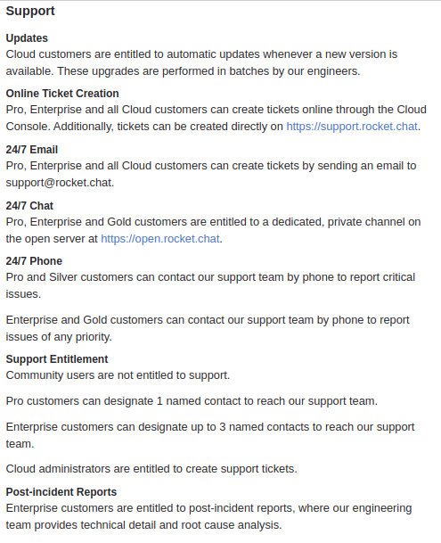

# Foward-From

Neste documento busca-se construir a matriz de pós-rastreabilidade através da ótica Foward-From. Foram feitas duas tabelas, a primeira para requisitos funcionais e a segunda para os não funcionais.

## Requisitos Funcionais

|Código|Descrição|US|Épico|Funcionalidade|
|---|---|---|----|----|
|RF1 |Tradução instântanea para mensagens em línguas diferentes da padrão| [US45](../Modelagem/backlog#us45)|[EP11](../Modelagem/backlog#ep11-acoes-do-channel)|[Tradução](#rf1_gif)|
|RF2 |O aplicativo deve ser capaz de realizar videoconferências em  grupo| [US46](../Modelagem/backlog#us46)| [EP11](../Modelagem/backlog#ep11-acoes-do-channel)|[Videoconferência em grupo](#rf2_gif)|
|RF3   |A aplicação deve oferecer ao usuário a possibilidade de entrar no app através de username e senha, previamente cadatrados no aplicativo      |[US01](../Modelagem/backlog.md#us01)  [US02](../Modelagem/backlog.md#us02)                                       |[EP01](Modelagem/backlog.md/#ep01-fazer-login)                                                                           |[Login](#RF3_gif)  [View](https://github.com/RocketChat/Rocket.Chat.ReactNative/blob/develop/app/views/LoginView.js)   [Action](https://github.com/RocketChat/Rocket.Chat.ReactNative/blob/develop/app/actions/login.js)|
|RF4   |O app deve permitir o cadastro na aplicação por contas de serviços de terceiros ou a partir de dados do usuário, como email, username e senha|[US03](../Modelagem/backlog.md#us03)  [US04](../Modelagem/backlog.md#us04)                                       |[EP02](../Modelagem/backlog.md/#ep02-fazer-cadastro)                                                                     |[Cadastro](#rf4_gif)   [View](https://github.com/RocketChat/Rocket.Chat.ReactNative/blob/develop/app/views/RegisterView.js)  [Utils](https://github.com/RocketChat/Rocket.Chat.ReactNative/blob/develop/app/utils/isValidEmail.js)|
|RF5   |O usuário deve ter a disposição, a criação de canais, subgrupos de discussão e grupos, privados/publicos, ilimitados.                        |[US18](../Modelagem/backlog#us18)   [US19](../Modelagem/backlog#us19)   [US21](../Modelagem/backlog.md#us21)      |[EP08](../Modelagem/backlog.md/#ep08-criar-channel)                                                                      |[Criar channel](#rf5_gif)   [View](https://github.com/RocketChat/Rocket.Chat.ReactNative/blob/develop/app/views/CreateChannelView.js)  [Action](https://github.com/RocketChat/Rocket.Chat.ReactNative/blob/develop/app/actions/createChannel.js) |
|RF6   |O usuário deve ser capaz de, dentro da plataforma, enviar mensagens dentro de grupos de conversa ou dentro de chats privados                 |[US20](../Modelagem/backlog#us20)                                                                               |[EP08](../Modelagem/backlog.md/#ep08-criar-channel)                                                                      |[Enviar mensagem](#rf6_gif)  [Código - Método "sendMessage"](https://github.com/RocketChat/Rocket.Chat.ReactNative/blob/develop/app/views/RoomView/index.js)           |
|RF7   |O usuário deve ser capaz de realizar uma busca de uma mensagem dentro de um determinado chat                                                 |[US48](../Modelagem/backlog#us48)                                                                               | [EP11](../Modelagem/backlog#ep11-acoes-do-channel)                                                                      |[Procurar mensagem](#RF7_gif)  [Código](https://github.com/RocketChat/Rocket.Chat.ReactNative/blob/develop/app/views/SearchMessagesView/index.js) |
|RF8   |O app deve oferecer a possibilidade do usuário instalar seu próprio servidor local. |[US65](../Modelagem/backlog#us65) | [EP16](../Modelagem/backlog#ep16-conectar-com-um-servidor)  |[Servidor](#rf8_gif) |
|RF9   |A plataforma deve permitir a integração de Bots|[US62](../Modelagem/backlog#us62) | [EP14](../Modelagem/backlog#ep14-integrações) | [Bots](#rf9_gif) |
|RF10  |A plataforma deve permitir a alteração nas configurações do app |[US09](../Modelagem/backlog#us09)| [EP05](../Modelagem/backlog#ep05-configurações-do-aplicativo)|[Configurações do app](#rf10_gif)  [View](https://github.com/RocketChat/Rocket.Chat.ReacótNative/blob/develop/app/views/SettingsView/index.js)  [Action](https://github.com/RocketChat/Rocket.Chat.ReactNative/blob/develop/app/actions/markdown.js)  [Util](https://github.com/RocketChat/Rocket.Chat.ReactNative/blob/develop/app/utils/deviceInfo.js)  [Util](https://github.com/RocketChat/Rocket.Chat.ReactNative/blob/develop/app/utils/info.js)|
|RF11  |Possibilidade de alteração do idioma no aplicativo                                                                                           |[US09](../Modelagem/backlog.md#us09), [US10](../Modelagem/backlog.md#us10)                                      | [EP05](../Modelagem/backlog#ep05-configurações-do-aplicativo)|[Alterar idioma](#rf11_gif) [View](https://github.com/RocketChat/Rocket.Chat.ReactNative/blob/develop/app/views/LanguageView/index.js)  [Util](https://github.com/RocketChat/Rocket.Chat.ReactNative/blob/develop/app/utils/info.js)
|RF12  ||| ||
|RF13  |Alteração de senha |[US12](../Modelagem/backlog.md#us12) | [EP05](../Modelagem/backlog#ep05-configurações-do-aplicativo)|[Alterar senha](#rf13_gif)  [Código - Método "newPassword"](https://github.com/RocketChat/Rocket.Chat.ReactNative/blob/develop/app/views/ProfileView/index.js)
|RF14  |Possibilidade de mencionar, um ou todos, os membros do grupo |[US43](../Modelagem/backlog.md#us43)| [EP11](../Modelagem/backlog#ep11-acoes-do-channel) | [Mencionar](#rf14_gif) |
|RF15  |Sistema deve ser capaz de Adicionar autenticação de 2 Fatores  |[US13](../Modelagem/backlog.md#us13) | [EP06](../Modelagem/backlog#ep06-configurações-da-conta)|[Autenticação 2 Fatores](#rf15_gif)|
|RF16  |Sistema deve mostrar e permitir a edição das configurações da conta |[US09](../Modelagem/backlog.md#us09)   [US14](../Modelagem/backlog.md#us14) | [EP05](../Modelagem/backlog#ep05-configurações-do-aplicativo)  [EP06](../Modelagem/backlog#ep06-configurações-da-conta)|[Editar conta](#rf16_gif)   [View](https://github.com/RocketChat/Rocket.Chat.ReactNative/blob/develop/app/views/ProfileView/index.js)   [Util](https://github.com/RocketChat/Rocket.Chat.ReactNative/blob/develop/app/utils/info.js) |
|RF17  |O sistema deve permitir o envio de arquivos e documentos em um chat |[US28](../Modelagem/backlog.md#us28)   [US33](../Modelagem/backlog.md#us33) | [EP10](../Modelagem/backlog#ep10-mensagens)  | [Envio de Arquivo](#rf17_gif) |
|RF18  |Permitir a alteração do status do usuário                                                                                                    |[US15](../Modelagem/backlog.md#us15)                                                                            | [EP06](../Modelagem/backlog#ep06-configurações-da-conta)                                                                |[Alterar status](#rf18_gif)   [Código - Método "renderStatusItem"](https://github.com/RocketChat/Rocket.Chat.ReactNative/blob/develop/app/views/SidebarView/index.js)  |
|RF19  |App deve possuir ferramenta para busca de Channels                                                                                           |[US16](../Modelagem/backlog.md#us16)                                                                            | [EP07](../Modelagem/backlog#ep07-channels)                                                                              |[Buscar channel](#rf_19_gif)   [Código - Método "search"](https://github.com/RocketChat/Rocket.Chat.ReactNative/blob/develop/app/views/RoomsListView/index.js)   |
|RF20  |App deve possuir opções para listar Channels em categorias |[US17](../Modelagem/backlog.md#us17) | [EP07](../Modelagem/backlog#ep07-channels) |[Ordenar por categoria](#rf20_gif)   [Código - Método "groupByType"](https://github.com/RocketChat/Rocket.Chat.ReactNative/blob/develop/app/views/RoomsListView/index.js)    |
|RF21  |Possibilidade de favoritar um grupo |[US42](../Modelagem/backlog.md#us42)| [EP11](../Modelagem/backlog#ep11-acoes-do-channel)| [Favoritar Channel](#rf21_gif)|
|RF22  |Permitir a alteração de privacidade do Channel|[US22](../Modelagem/backlog.md#us22)| [EP09](../Modelagem/backlog#ep09-configurações-do-channel) |[Privacidade do Channel](#rf22_gif)|
|RF23  |Definir Channel como Read Only |[US23](../Modelagem/backlog.md#us23) | [EP09](../Modelagem/backlog#ep09-configurações-do-channel) | [Read Only](#rf23_gif)|
|RF24  |Definir Channel para BroadCast |[US24](../Modelagem/backlog.md#us24) | [EP09](../Modelagem/backlog#ep09-configurações-do-channel) |[BroadCast](#rf24_gif) |
|RF25  |Permitir que o usuário possa adicionar ou visualizar as informações do Channel através de uma descrição, tópico do Channel |[US25](../Modelagem/backlog.md#us25)   [US26](../Modelagem/backlog.md#us26)   [US47](../Modelagem/backlog.md#us47)| [EP09](../Modelagem/backlog#ep09-configurações-do-channel)    [EP11](../Modelagem/backlog#ep11-acoes-do-channel) |[Adicionar descrição](#rf25_gif)   [Código - Método "description"](https://github.com/RocketChat/Rocket.Chat.ReactNative/blob/develop/app/views/RoomInfoEditView/index.js) |
|RF26  |App deve permitir o envio de desenhos, como mensagens |[US30](../Modelagem/backlog.md#us30) | [EP10](../Modelagem/backlog#ep10-mensagens) |[Desenho](#rf26_gif) |
|RF27  |O sistema deve permitir o envio de arquivos de midia, como vídeo e áudio |[US31](../Modelagem/backlog.md#us31) | [EP10](../Modelagem/backlog#ep10-mensagens) |[Midia](#rf27_gif) |
|RF28  |O usuário deve poder editar suas mensagens enviadas |[US34](../Modelagem/backlog.md#us34) | [EP10](../Modelagem/backlog#ep10-mensagens) |[Editar Mensagens](#rf28_gif) |
|RF29  |O usuário deve poder copiar uma mensagem |[US35](../Modelagem/backlog.md#us35) | [EP10](../Modelagem/backlog#ep10-mensagens) |[Copiar Mensagem](#rf29_gif) |
|RF30  |O sistema deve oferecer uma maneira para o usuário possa compartilhar mensagens |[US36](../Modelagem/backlog.md#us36) | [EP10](../Modelagem/backlog#ep10-mensagens) |[Compartilhar Mensagens](#rf30_gif) |
|RF31  |O usuário deve ter a possibilidade excluir uma mensagem a qualquer momento |[US38](../Modelagem/backlog.md#us38) | [EP10](../Modelagem/backlog#ep10-mensagens) |[Excluir Mensagem](#rf31_gif) |
|RF32  |Usuário deve poder adicionar reações a mensagens |[US39](../Modelagem/backlog.md#us39) | [EP10](../Modelagem/backlog#ep10-mensagens) |[Adicionar reação a mensagens](#rf32_gif)   [Código - Método onReactionPress](https://github.com/RocketChat/Rocket.Chat.ReactNative/blob/develop/app/views/RoomView/index.js)   [Código](https://github.com/RocketChat/Rocket.Chat.ReactNative/blob/develop/app/containers/ReactionsModal.js) |
|RF33  |Usuário deve ser capaz de responder mensagens enviadas dentro de Channels que ele participa |[US40](../Modelagem/backlog.md#us40) | [EP10](../Modelagem/backlog#ep10-mensagens) |[Responder Mensagem](#rf33_gif) |
|RF34  |Usuário deve ter a possibilidade de reportar alguma mensagem em um Channel que não respeite as diretrizes do app |[US41](../Modelagem/backlog.md#us41) | [EP10](../Modelagem/backlog#ep10-mensagens) |[Reportar Mensagem](#rf34_gif)|
|RF35  | | | | |
|RF36  |A aplicação deve fornecer suporte aos seus usuários via chat e e-mail.|[US05](../Modelagem/backlog.md#us05)   [US06](../Modelagem/backlog.md#us06) |[EP03](../Modelagem/backlog.md/#ep02-atendimento-online) |[Suporte](#rf36_gif) |
|RF37  | | | | |

## Requisitos Não-Funcionais

|Código|Descrição                                                                                                                    |NFR                                                          |Operacionalizações                                                                                              |Funcionalidade                                                                                                                                                                |
|------|-----------------------------------------------------------------------------------------------------------------------------|-------------------------------------------------------------|----------------------------------------------------------------------------------------------------------------|------------------------------------------------------------------------------------------------------------------------------------------------------------------------------|
|RNF1  |A aplicação deve ser capaz de ser executada em diversas plataformas                                                          |[NFR-Portabilidade](../Modelagem/nfr.md#nfr1-portabilidade)  |"Acesso por aplicação mobile".  "Acesso por aplicação web";  "Acesso por aplicação desktop";                    |[Plataformas](https://rocket.chat/)                                                                                                                                                              |
|RNF2  |O Rocket.chat deve ofecer suporte tanto para a aplicação, em diversas arquiteturas, como para o usuário                      |[NFR-03](../Modelagem/nfr.md#nfr3-suporte)                   |"Documentação" "Suporte online"                                                                                 |                                                                                                                                                                              |
|RNF3  |Deve ser uma plataforma que ofereça segurança com dados dos usuários.                                                        |[NFR-03](../Modelagem/nfr.md#nfr3-suporte)                   |"Criptografia ponta a ponta" "Backup de dados"                                                                  |                                                                                                                                                                              |
|RNF4  |O Rocket.chat deve estar disponível na maior quantidade possível de idiomas                                                  |[NFR-05](../Modelagem/nfr.md#nfr5-personabilidade)           |"Traduzir todos os menus do app para diferentes linguagens" "permitir a escolha de nova linguagem dentro do app"|                                                                                                                                                                              |
|RNF5  |O Rocket.chat deve ter uma boa interface visual, minimalista e intuitiva, facilitando a usabilidade do usuário.              |[NFR-04](../Modelagem/nfr.md#nfr4-usabilidade)               |"Layout simples"; "Icones intuitivos"; "Descrições"                                                             |[Repositório aplicação desktop/web](https://github.com/RocketChat/Rocket.Chat.Electron)  [Repositório aplicação mobile](https://github.com/RocketChat/Rocket.Chat.ReactNative)|
|RNF6  |A plataforma deve possuir uma documentação bem organizada. Que explique todas as funcionalidades e restrições aplicáveis.    |[NFR-03](../Modelagem/nfr.md#nfr3-suporte)                   |"Documentação"                                                                                                  |                                                                                                                                                                              |
|RNF7  |A aplicação, sendo do tipo openSource, deve possuir a liberdade da contribuição pela comunidade de software                  |[NFR-08](../Modelagem/nfr.md#nfr8-contribuiçao-da-comunidade)|"Encorajar a evolução do código existente""Divulgar as vantagens da comunidade ser ativa"                       |                                                                                                                                                                              |
|RNF8  |A aplicação deve oferecer uma performace fluida ajude na experiência positiva do usuário                                     |[NFR-02](../Modelagem/nfr.md#nfr2-performace-do-chat)        |"Compressão de dados" "uso de cach para dados não modificados"                                                  |                                                                                                                                                                              |
|RNF9  |Visando uma melhor experiência ao usuário e desempenho da plataforma, o app deve fazer integrações com diferentes plataformas|[NFR-09](../Modelagem/nfr.md#nfr2-conectividade)             |"Integrável com redes sociais para autenticação"                                                                |                                                                                                                                                                              |
|RNF10 |A plataforma deve identificar e tratar erros dentro do aplicativo                                                            |                                                             |                                                                                                                |                                                                                                                                                                              |

## Gifs

### RF1_GIF

### RF2_GIF

### RF3_GIF

### RF4_GIF

### RF5_GIF

### RF6_GIF

### RF7_GIF

### RF8_GIF

### RF9_GIF

### RF10_GIF

### RF11_GIF

### RF12_GIF

### RF13_GIF

### RF14_GIF

### RF15_GIF

### RF16_GIF

### RF17_GIF

### RF18_GIF

### RF19_GIF

### RF20_GIF

### RF21_GIF

### RF22_GIF

### RF23_GIF

### RF24_GIF

### RF25_GIF

### RF26_GIF

### RF27_GIF

### RF28_GIF

### RF29_GIF

### RF30_GIF

### RF31_GIF

### RF32_GIF

### RF33_GIF

### RF34_GIF

### RF35_GIF

### RF36_GIF

### RF37_GIF

### rnf1

Mobile

Web navegador

Desktop

### rnf2

Suporte

## Versionamento

| Data | Versão | Modificação | Autor |
|------|--------|-------------|-------|
| 16/06/2019 | 1.0 | Abertura do documento | Marcos Nery |
| 17/06/2019 | 1.1 | Inclusão das tabelas inicias de requisitos | Marcos Nery |
| 18/06/2019 | 1.2 | Inclusão dos elos | Marcos Nery |
| 19/06/2019 | 1.3 | Inclusão dos GIFS | André Lucas |
